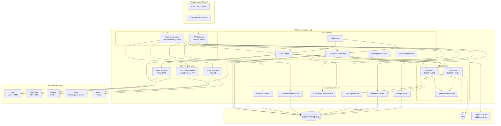
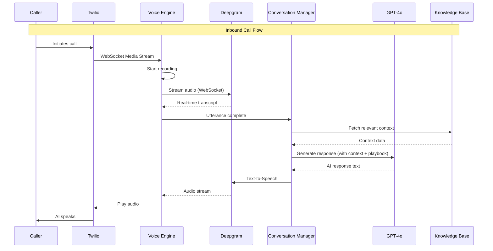
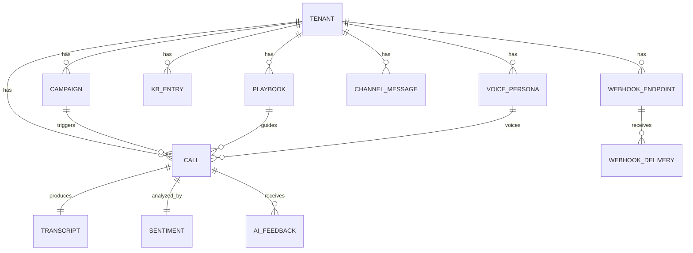
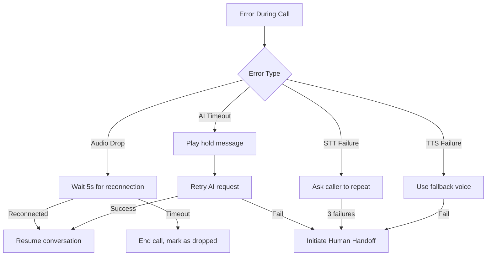

# Design Document: AI Communication Hub

## Overview

The AI Communication Hub is a standalone, multi-tenant, AI-powered communication management platform that integrates with PracticeNudge. It enables businesses to automate and manage customer communications across voice calls (MVP), email, WhatsApp, and SMS channels with full AI assistance and human oversight.

The platform follows a microservices-oriented architecture deployed as a set of independent services communicating via message queues and event streams. The MVP focuses on the Voice Call system, with other channels built on the same foundational patterns.

### Key Design Decisions

1. **Separate Backend Service**: The AI Communication Hub runs as a standalone Node.js/TypeScript service (not embedded in the Next.js app) to handle real-time voice processing, WebSocket connections, and long-running call sessions independently from the PracticeNudge web application.

2. **Twilio for Telephony**: Twilio Programmable Voice with Media Streams provides the telephony infrastructure, enabling WebSocket-based real-time audio streaming for AI processing.

3. **Deepgram for Speech Processing**: Deepgram's streaming STT and TTS APIs provide sub-500ms latency for real-time transcription and natural voice synthesis, with native support for English and Turkish.

4. **OpenAI GPT-4o for Conversation AI**: GPT-4o with function calling powers the Conversation Manager, enabling natural dialogue, intent recognition, and dynamic responses guided by Playbooks and Knowledge Base context.

5. **Supabase as Shared Data Layer**: Supabase PostgreSQL serves as the primary database for both PracticeNudge and the Communication Hub, enabling seamless integration while maintaining tenant isolation through Row Level Security (RLS).

6. **Redis + BullMQ for Job Processing**: Campaign scheduling, webhook delivery, and async tasks use BullMQ backed by Redis for reliable, scalable job processing with retry logic.

7. **Event-Driven Architecture**: All significant platform events are published to an internal event bus, enabling loose coupling between components and powering the webhook system, analytics, and real-time dashboards.

## Architecture

### High-Level System Architecture



### Voice Call Flow (MVP)



### Deployment Architecture

The system deploys as containerized services on a cloud platform (AWS ECS or similar):

- **API Gateway**: Stateless, horizontally scalable Express.js service
- **Voice Engine**: Stateful WebSocket server (sticky sessions per active call)
- **Conversation Manager**: Stateless service, scales with concurrent calls
- **Worker Services**: BullMQ workers for campaigns, webhooks, analytics aggregation
- **Management API**: Stateless CRUD services for configuration entities


## Components and Interfaces

### 1. API Gateway

**Responsibility**: Authentication, rate limiting, request routing, and OpenAPI documentation.

```typescript
// src/api-gateway/router.ts
interface APIGatewayConfig {
  rateLimits: Record<string, { requests: number; windowMs: number }>;
  authProviders: ('api_key' | 'oauth2')[];
}

interface APIRequest {
  tenantId: string;
  userId: string;
  correlationId: string;
  method: string;
  path: string;
  body: unknown;
  headers: Record<string, string>;
}

interface APIResponse {
  status: number;
  body: {
    data?: unknown;
    error?: {
      code: string;
      message: string;
      correlationId: string;
    };
  };
}
```

### 2. Voice Engine

**Responsibility**: Manages telephony connections, audio streaming, recording, and TTS playback.

```typescript
// src/voice-engine/types.ts
interface VoiceEngineConfig {
  twilioAccountSid: string;
  twilioAuthToken: string;
  deepgramApiKey: string;
  maxConcurrentCalls: number;
  recordingStorageBucket: string;
}

interface ActiveCall {
  callId: string;
  tenantId: string;
  direction: 'inbound' | 'outbound';
  status: 'ringing' | 'connected' | 'on_hold' | 'transferring' | 'completed';
  startedAt: Date;
  callerNumber: string;
  recipientNumber: string;
  playbook: Playbook;
  voicePersona: VoicePersona;
  recordingEnabled: boolean;
  metadata: Record<string, unknown>;
}

interface VoiceEngine {
  initiateOutboundCall(params: OutboundCallParams): Promise<ActiveCall>;
  handleInboundCall(twilioEvent: TwilioWebhookEvent): Promise<ActiveCall>;
  streamAudioToSTT(callId: string, audioChunk: Buffer): void;
  playTTSResponse(callId: string, text: string): Promise<void>;
  transferToOperator(callId: string, operatorId: string): Promise<void>;
  endCall(callId: string, reason: string): Promise<CallSummary>;
  stopRecording(callId: string): void;
}

interface OutboundCallParams {
  tenantId: string;
  recipientNumber: string;
  playbookId: string;
  voicePersonaId: string;
  campaignId?: string;
  context: Record<string, unknown>;
}
```

### 3. Conversation Manager

**Responsibility**: Orchestrates AI dialogue, maintains conversation state, executes playbook logic.

```typescript
// src/conversation-manager/types.ts
interface ConversationState {
  conversationId: string;
  callId: string;
  tenantId: string;
  playbook: Playbook;
  currentNode: PlaybookNode;
  messageHistory: ConversationMessage[];
  context: ConversationContext;
  sentiment: SentimentScore;
  clarificationAttempts: number;
  handoffRequested: boolean;
}

interface ConversationMessage {
  role: 'caller' | 'ai' | 'system';
  content: string;
  timestamp: Date;
  sentiment?: SentimentScore;
}

interface ConversationContext {
  callerInfo: Record<string, unknown>;
  knowledgeBaseEntries: KBEntry[];
  playbookVariables: Record<string, unknown>;
  tenantConfig: TenantConfig;
}

interface ConversationManager {
  startConversation(call: ActiveCall): Promise<ConversationState>;
  processUtterance(conversationId: string, text: string): Promise<string>;
  shouldHandoff(state: ConversationState): boolean;
  getConversationSummary(conversationId: string): Promise<ConversationSummary>;
  endConversation(conversationId: string): Promise<void>;
}
```

### 4. Call Router

**Responsibility**: Routes inbound calls, manages handoff logic, operator queue.

```typescript
// src/call-router/types.ts
interface RoutingRule {
  tenantId: string;
  conditions: RoutingCondition[];
  action: 'ai_handle' | 'human_handoff' | 'voicemail' | 'after_hours_playbook';
  priority: number;
}

interface CallRouter {
  routeInboundCall(call: InboundCallEvent): Promise<RoutingDecision>;
  initiateHandoff(callId: string, reason: string): Promise<HandoffResult>;
  getAvailableOperators(tenantId: string): Promise<Operator[]>;
  queueForHandoff(callId: string): Promise<QueuePosition>;
}

interface HandoffResult {
  success: boolean;
  operatorId?: string;
  estimatedWaitTime?: number;
  queuePosition?: number;
}
```

### 5. Transcription Engine

**Responsibility**: Real-time STT via Deepgram, post-call transcript generation.

```typescript
// src/transcription-engine/types.ts
interface TranscriptionConfig {
  language: 'en' | 'tr' | string;
  model: 'nova-2' | 'nova-2-general';
  punctuate: boolean;
  utteranceEndMs: number;
  interimResults: boolean;
}

interface TranscriptionEngine {
  startLiveTranscription(callId: string, config: TranscriptionConfig): Promise<void>;
  processAudioChunk(callId: string, audio: Buffer): void;
  onUtteranceComplete(callback: (callId: string, text: string, isFinal: boolean) => void): void;
  generatePostCallTranscript(callId: string): Promise<Transcript>;
  detectLanguage(audioSample: Buffer): Promise<string>;
}

interface Transcript {
  callId: string;
  segments: TranscriptSegment[];
  duration: number;
  language: string;
  wordAccuracy: number;
}

interface TranscriptSegment {
  speaker: 'caller' | 'ai';
  text: string;
  startTime: number;
  endTime: number;
  confidence: number;
}
```

### 6. Sentiment Analyzer

**Responsibility**: Real-time sentiment scoring and alerting.

```typescript
// src/sentiment-analyzer/types.ts
type SentimentLevel = 'very_negative' | 'negative' | 'neutral' | 'positive' | 'very_positive';

interface SentimentScore {
  level: SentimentLevel;
  score: number; // -1.0 to 1.0
  confidence: number;
  timestamp: Date;
}

interface SentimentSummary {
  callId: string;
  overallScore: number;
  overallLevel: SentimentLevel;
  trajectory: SentimentScore[];
  keyMoments: { timestamp: Date; text: string; sentiment: SentimentScore }[];
}

interface SentimentAnalyzer {
  analyzeSentiment(text: string, context: ConversationMessage[]): Promise<SentimentScore>;
  getSentimentSummary(callId: string): Promise<SentimentSummary>;
  checkThreshold(tenantId: string, score: SentimentScore): boolean;
}
```

### 7. Channel Gateways

```typescript
// src/channels/types.ts
interface ChannelMessage {
  channelType: 'email' | 'whatsapp' | 'sms';
  tenantId: string;
  direction: 'inbound' | 'outbound';
  from: string;
  to: string;
  content: string;
  metadata: Record<string, unknown>;
  threadId?: string;
}

interface EmailGateway {
  sendEmail(params: EmailParams): Promise<{ messageId: string }>;
  processInboundEmail(raw: InboundEmailEvent): Promise<ChannelMessage>;
  generateAIDraft(threadId: string, context: string): Promise<string>;
}

interface WhatsAppGateway {
  sendMessage(params: WhatsAppParams): Promise<{ messageId: string }>;
  processInboundMessage(event: WhatsAppWebhookEvent): Promise<ChannelMessage>;
  sendTemplateMessage(params: TemplateParams): Promise<{ messageId: string }>;
}

interface SMSGateway {
  sendSMS(params: SMSParams): Promise<{ messageId: string; status: string }>;
  processInboundSMS(event: TwilioSMSEvent): Promise<ChannelMessage>;
  handleOptOut(phoneNumber: string, tenantId: string): Promise<void>;
}
```

### 8. Playbook Service

```typescript
// src/playbook/types.ts
interface Playbook {
  id: string;
  tenantId: string;
  name: string;
  version: number;
  status: 'draft' | 'active' | 'archived';
  greeting: PlaybookNode;
  primaryGoal: string;
  closingSequence: PlaybookNode;
  nodes: PlaybookNode[];
  languageTemplates: Record<string, Record<string, string>>;
  createdAt: Date;
  updatedAt: Date;
}

interface PlaybookNode {
  id: string;
  type: 'greeting' | 'question' | 'response' | 'decision' | 'action' | 'closing';
  content: string;
  branches: PlaybookBranch[];
  fallback?: string;
}

interface PlaybookBranch {
  condition: string;
  nextNodeId: string;
}

interface PlaybookService {
  createPlaybook(tenantId: string, data: CreatePlaybookDTO): Promise<Playbook>;
  updatePlaybook(playbookId: string, data: UpdatePlaybookDTO): Promise<Playbook>;
  activateVersion(playbookId: string, version: number): Promise<void>;
  validatePlaybook(playbook: Playbook): ValidationResult;
  getPlaybookVersions(playbookId: string): Promise<Playbook[]>;
}

interface ValidationResult {
  valid: boolean;
  errors: { field: string; message: string }[];
}
```

### 9. Knowledge Base Service

```typescript
// src/knowledge-base/types.ts
interface KBEntry {
  id: string;
  tenantId: string;
  category: string;
  type: 'text' | 'faq' | 'table';
  title: string;
  content: string;
  embedding?: number[];
  metadata: Record<string, unknown>;
  updatedAt: Date;
}

interface KnowledgeBaseService {
  addEntry(tenantId: string, entry: CreateKBEntryDTO): Promise<KBEntry>;
  updateEntry(entryId: string, data: UpdateKBEntryDTO): Promise<KBEntry>;
  removeEntry(entryId: string): Promise<void>;
  search(tenantId: string, query: string, limit?: number): Promise<KBEntry[]>;
  getByCategory(tenantId: string, category: string): Promise<KBEntry[]>;
}
```

### 10. Campaign Service

```typescript
// src/campaign/types.ts
interface Campaign {
  id: string;
  tenantId: string;
  name: string;
  channel: 'voice' | 'email' | 'whatsapp' | 'sms';
  playbookId: string;
  status: 'draft' | 'scheduled' | 'running' | 'paused' | 'completed' | 'failed';
  recipients: CampaignRecipient[];
  schedule: CampaignSchedule;
  concurrencyLimit: number;
  retryPolicy: RetryPolicy;
  progress: CampaignProgress;
}

interface CampaignSchedule {
  startAt: Date;
  timezone: string;
  allowedHoursStart: string; // "09:00"
  allowedHoursEnd: string;   // "20:00"
  respectRecipientTimezone: boolean;
}

interface CampaignProgress {
  total: number;
  completed: number;
  inProgress: number;
  failed: number;
  successRate: number;
  estimatedCompletionTime?: Date;
}

interface CampaignService {
  createCampaign(tenantId: string, data: CreateCampaignDTO): Promise<Campaign>;
  startCampaign(campaignId: string): Promise<void>;
  pauseCampaign(campaignId: string): Promise<void>;
  getCampaignProgress(campaignId: string): Promise<CampaignProgress>;
  checkFailureThreshold(campaignId: string): Promise<boolean>;
}
```

### 11. Webhook Dispatcher

```typescript
// src/webhooks/types.ts
interface WebhookEndpoint {
  id: string;
  tenantId: string;
  url: string;
  secret: string;
  eventTypes: WebhookEventType[];
  active: boolean;
}

type WebhookEventType =
  | 'call.started' | 'call.ended' | 'call.handoff'
  | 'message.received' | 'message.sent'
  | 'sentiment.alert' | 'campaign.completed'
  | 'recording.ready' | 'transcript.ready';

interface WebhookPayload {
  id: string;
  type: WebhookEventType;
  tenantId: string;
  timestamp: Date;
  data: Record<string, unknown>;
  signature: string;
}

interface WebhookDispatcher {
  registerEndpoint(tenantId: string, config: CreateWebhookDTO): Promise<WebhookEndpoint>;
  dispatch(event: PlatformEvent): Promise<void>;
  signPayload(payload: object, secret: string): string;
  getDeliveryLog(tenantId: string, filters: DeliveryLogFilters): Promise<DeliveryLogEntry[]>;
}
```

### 12. Billing Service

```typescript
// src/billing/types.ts
interface UsageRecord {
  tenantId: string;
  metric: 'voice_minutes' | 'messages_sent' | 'messages_received' | 'api_calls' | 'storage_gb';
  quantity: number;
  timestamp: Date;
  metadata: Record<string, unknown>;
}

interface BillingService {
  trackUsage(record: UsageRecord): Promise<void>;
  getUsageSummary(tenantId: string, period: DateRange): Promise<UsageSummary>;
  checkFreeTierLimits(tenantId: string): Promise<FreeTierStatus>;
  generateInvoice(tenantId: string, period: DateRange): Promise<Invoice>;
}
```


## Data Models

### Database Schema (Supabase PostgreSQL)

```sql
-- Tenant Management
CREATE TABLE tenants (
  id UUID PRIMARY KEY DEFAULT gen_random_uuid(),
  name TEXT NOT NULL,
  slug TEXT UNIQUE NOT NULL,
  plan TEXT NOT NULL DEFAULT 'free', -- free, starter, professional, enterprise
  custom_domain TEXT,
  settings JSONB NOT NULL DEFAULT '{}',
  created_at TIMESTAMPTZ NOT NULL DEFAULT NOW(),
  updated_at TIMESTAMPTZ NOT NULL DEFAULT NOW()
);

-- Voice Personas
CREATE TABLE voice_personas (
  id UUID PRIMARY KEY DEFAULT gen_random_uuid(),
  tenant_id UUID NOT NULL REFERENCES tenants(id) ON DELETE CASCADE,
  name TEXT NOT NULL,
  language TEXT NOT NULL DEFAULT 'en',
  accent TEXT,
  speaking_pace REAL NOT NULL DEFAULT 1.0,
  pitch REAL NOT NULL DEFAULT 1.0,
  tone TEXT NOT NULL DEFAULT 'professional',
  tts_model TEXT NOT NULL,
  tts_voice_id TEXT NOT NULL,
  is_template BOOLEAN NOT NULL DEFAULT FALSE,
  active BOOLEAN NOT NULL DEFAULT TRUE,
  created_at TIMESTAMPTZ NOT NULL DEFAULT NOW(),
  updated_at TIMESTAMPTZ NOT NULL DEFAULT NOW()
);

-- Playbooks
CREATE TABLE playbooks (
  id UUID PRIMARY KEY DEFAULT gen_random_uuid(),
  tenant_id UUID NOT NULL REFERENCES tenants(id) ON DELETE CASCADE,
  name TEXT NOT NULL,
  description TEXT,
  version INTEGER NOT NULL DEFAULT 1,
  status TEXT NOT NULL DEFAULT 'draft', -- draft, active, archived
  greeting_node JSONB NOT NULL,
  primary_goal TEXT NOT NULL,
  closing_node JSONB NOT NULL,
  nodes JSONB NOT NULL DEFAULT '[]',
  language_templates JSONB NOT NULL DEFAULT '{}',
  created_at TIMESTAMPTZ NOT NULL DEFAULT NOW(),
  updated_at TIMESTAMPTZ NOT NULL DEFAULT NOW(),
  UNIQUE(tenant_id, name, version)
);

-- Knowledge Base
CREATE TABLE knowledge_base_entries (
  id UUID PRIMARY KEY DEFAULT gen_random_uuid(),
  tenant_id UUID NOT NULL REFERENCES tenants(id) ON DELETE CASCADE,
  category TEXT NOT NULL,
  type TEXT NOT NULL DEFAULT 'text', -- text, faq, table
  title TEXT NOT NULL,
  content TEXT NOT NULL,
  embedding VECTOR(1536),
  metadata JSONB NOT NULL DEFAULT '{}',
  created_at TIMESTAMPTZ NOT NULL DEFAULT NOW(),
  updated_at TIMESTAMPTZ NOT NULL DEFAULT NOW()
);

-- Calls
CREATE TABLE calls (
  id UUID PRIMARY KEY DEFAULT gen_random_uuid(),
  tenant_id UUID NOT NULL REFERENCES tenants(id) ON DELETE CASCADE,
  direction TEXT NOT NULL, -- inbound, outbound
  status TEXT NOT NULL DEFAULT 'initiated',
  caller_number TEXT NOT NULL,
  recipient_number TEXT NOT NULL,
  playbook_id UUID REFERENCES playbooks(id),
  voice_persona_id UUID REFERENCES voice_personas(id),
  campaign_id UUID REFERENCES campaigns(id),
  operator_id UUID,
  started_at TIMESTAMPTZ,
  answered_at TIMESTAMPTZ,
  ended_at TIMESTAMPTZ,
  duration_seconds INTEGER,
  recording_url TEXT,
  recording_encrypted BOOLEAN NOT NULL DEFAULT TRUE,
  handoff_occurred BOOLEAN NOT NULL DEFAULT FALSE,
  handoff_reason TEXT,
  outcome TEXT, -- reached, voicemail, no_answer, completed, failed
  metadata JSONB NOT NULL DEFAULT '{}',
  created_at TIMESTAMPTZ NOT NULL DEFAULT NOW()
);

-- Call Transcripts
CREATE TABLE call_transcripts (
  id UUID PRIMARY KEY DEFAULT gen_random_uuid(),
  call_id UUID NOT NULL REFERENCES calls(id) ON DELETE CASCADE,
  tenant_id UUID NOT NULL REFERENCES tenants(id) ON DELETE CASCADE,
  segments JSONB NOT NULL DEFAULT '[]',
  full_text TEXT,
  language TEXT NOT NULL DEFAULT 'en',
  word_accuracy REAL,
  generated_at TIMESTAMPTZ NOT NULL DEFAULT NOW()
);

-- Sentiment Records
CREATE TABLE call_sentiments (
  id UUID PRIMARY KEY DEFAULT gen_random_uuid(),
  call_id UUID NOT NULL REFERENCES calls(id) ON DELETE CASCADE,
  tenant_id UUID NOT NULL REFERENCES tenants(id) ON DELETE CASCADE,
  overall_score REAL NOT NULL,
  overall_level TEXT NOT NULL,
  trajectory JSONB NOT NULL DEFAULT '[]',
  key_moments JSONB NOT NULL DEFAULT '[]',
  created_at TIMESTAMPTZ NOT NULL DEFAULT NOW()
);

-- Campaigns
CREATE TABLE campaigns (
  id UUID PRIMARY KEY DEFAULT gen_random_uuid(),
  tenant_id UUID NOT NULL REFERENCES tenants(id) ON DELETE CASCADE,
  name TEXT NOT NULL,
  channel TEXT NOT NULL, -- voice, email, whatsapp, sms
  playbook_id UUID REFERENCES playbooks(id),
  status TEXT NOT NULL DEFAULT 'draft',
  recipients JSONB NOT NULL DEFAULT '[]',
  schedule JSONB NOT NULL,
  concurrency_limit INTEGER NOT NULL DEFAULT 10,
  retry_policy JSONB NOT NULL DEFAULT '{"maxRetries": 3, "delayMinutes": 30}',
  progress JSONB NOT NULL DEFAULT '{"total": 0, "completed": 0, "failed": 0}',
  failure_threshold REAL NOT NULL DEFAULT 0.5,
  created_at TIMESTAMPTZ NOT NULL DEFAULT NOW(),
  updated_at TIMESTAMPTZ NOT NULL DEFAULT NOW()
);

-- Channel Messages (Email, WhatsApp, SMS)
CREATE TABLE channel_messages (
  id UUID PRIMARY KEY DEFAULT gen_random_uuid(),
  tenant_id UUID NOT NULL REFERENCES tenants(id) ON DELETE CASCADE,
  channel TEXT NOT NULL, -- email, whatsapp, sms
  direction TEXT NOT NULL, -- inbound, outbound
  thread_id TEXT,
  from_address TEXT NOT NULL,
  to_address TEXT NOT NULL,
  content TEXT NOT NULL,
  ai_draft TEXT,
  status TEXT NOT NULL DEFAULT 'pending', -- pending, approved, sent, delivered, failed
  approval_required BOOLEAN NOT NULL DEFAULT FALSE,
  approved_by UUID,
  metadata JSONB NOT NULL DEFAULT '{}',
  created_at TIMESTAMPTZ NOT NULL DEFAULT NOW(),
  sent_at TIMESTAMPTZ
);

-- Webhook Endpoints
CREATE TABLE webhook_endpoints (
  id UUID PRIMARY KEY DEFAULT gen_random_uuid(),
  tenant_id UUID NOT NULL REFERENCES tenants(id) ON DELETE CASCADE,
  url TEXT NOT NULL,
  secret TEXT NOT NULL,
  event_types TEXT[] NOT NULL,
  active BOOLEAN NOT NULL DEFAULT TRUE,
  created_at TIMESTAMPTZ NOT NULL DEFAULT NOW()
);

-- Webhook Delivery Log
CREATE TABLE webhook_deliveries (
  id UUID PRIMARY KEY DEFAULT gen_random_uuid(),
  webhook_endpoint_id UUID NOT NULL REFERENCES webhook_endpoints(id) ON DELETE CASCADE,
  tenant_id UUID NOT NULL REFERENCES tenants(id) ON DELETE CASCADE,
  event_type TEXT NOT NULL,
  payload JSONB NOT NULL,
  response_status INTEGER,
  response_body TEXT,
  delivered_at TIMESTAMPTZ,
  attempts INTEGER NOT NULL DEFAULT 0,
  next_retry_at TIMESTAMPTZ,
  status TEXT NOT NULL DEFAULT 'pending', -- pending, delivered, failed
  created_at TIMESTAMPTZ NOT NULL DEFAULT NOW()
);

-- Usage Tracking
CREATE TABLE usage_records (
  id UUID PRIMARY KEY DEFAULT gen_random_uuid(),
  tenant_id UUID NOT NULL REFERENCES tenants(id) ON DELETE CASCADE,
  metric TEXT NOT NULL,
  quantity REAL NOT NULL,
  recorded_at TIMESTAMPTZ NOT NULL DEFAULT NOW(),
  metadata JSONB NOT NULL DEFAULT '{}'
);

-- AI Feedback
CREATE TABLE ai_feedback (
  id UUID PRIMARY KEY DEFAULT gen_random_uuid(),
  tenant_id UUID NOT NULL REFERENCES tenants(id) ON DELETE CASCADE,
  call_id UUID REFERENCES calls(id),
  transcript_segment_index INTEGER,
  rating INTEGER NOT NULL CHECK (rating >= 1 AND rating <= 5),
  preferred_response TEXT,
  operator_id UUID NOT NULL,
  incorporated_at TIMESTAMPTZ,
  created_at TIMESTAMPTZ NOT NULL DEFAULT NOW()
);

-- Audit Log
CREATE TABLE audit_logs (
  id UUID PRIMARY KEY DEFAULT gen_random_uuid(),
  tenant_id UUID NOT NULL REFERENCES tenants(id) ON DELETE CASCADE,
  user_id UUID NOT NULL,
  action TEXT NOT NULL,
  resource_type TEXT NOT NULL,
  resource_id TEXT,
  details JSONB NOT NULL DEFAULT '{}',
  ip_address INET,
  created_at TIMESTAMPTZ NOT NULL DEFAULT NOW()
);

-- Opt-out Registry (SMS/WhatsApp)
CREATE TABLE opt_outs (
  id UUID PRIMARY KEY DEFAULT gen_random_uuid(),
  tenant_id UUID NOT NULL REFERENCES tenants(id) ON DELETE CASCADE,
  channel TEXT NOT NULL, -- sms, whatsapp
  phone_number TEXT NOT NULL,
  opted_out_at TIMESTAMPTZ NOT NULL DEFAULT NOW(),
  UNIQUE(tenant_id, channel, phone_number)
);

-- Row Level Security
ALTER TABLE tenants ENABLE ROW LEVEL SECURITY;
ALTER TABLE voice_personas ENABLE ROW LEVEL SECURITY;
ALTER TABLE playbooks ENABLE ROW LEVEL SECURITY;
ALTER TABLE knowledge_base_entries ENABLE ROW LEVEL SECURITY;
ALTER TABLE calls ENABLE ROW LEVEL SECURITY;
ALTER TABLE call_transcripts ENABLE ROW LEVEL SECURITY;
ALTER TABLE call_sentiments ENABLE ROW LEVEL SECURITY;
ALTER TABLE campaigns ENABLE ROW LEVEL SECURITY;
ALTER TABLE channel_messages ENABLE ROW LEVEL SECURITY;
ALTER TABLE webhook_endpoints ENABLE ROW LEVEL SECURITY;
ALTER TABLE webhook_deliveries ENABLE ROW LEVEL SECURITY;
ALTER TABLE usage_records ENABLE ROW LEVEL SECURITY;
ALTER TABLE ai_feedback ENABLE ROW LEVEL SECURITY;
ALTER TABLE audit_logs ENABLE ROW LEVEL SECURITY;
ALTER TABLE opt_outs ENABLE ROW LEVEL SECURITY;

-- RLS Policies (example for calls table)
CREATE POLICY "Tenants can only access their own calls"
  ON calls FOR ALL
  USING (tenant_id = current_setting('app.current_tenant_id')::UUID);

-- Indexes for performance
CREATE INDEX idx_calls_tenant_status ON calls(tenant_id, status);
CREATE INDEX idx_calls_campaign ON calls(campaign_id) WHERE campaign_id IS NOT NULL;
CREATE INDEX idx_channel_messages_thread ON channel_messages(thread_id) WHERE thread_id IS NOT NULL;
CREATE INDEX idx_knowledge_base_tenant_category ON knowledge_base_entries(tenant_id, category);
CREATE INDEX idx_usage_records_tenant_metric ON usage_records(tenant_id, metric, recorded_at);
CREATE INDEX idx_audit_logs_tenant_date ON audit_logs(tenant_id, created_at);
CREATE INDEX idx_webhook_deliveries_status ON webhook_deliveries(status, next_retry_at) WHERE status = 'pending';
```

### Key Data Relationships




## Correctness Properties

*A property is a characteristic or behavior that should hold true across all valid executions of a system—essentially, a formal statement about what the system should do. Properties serve as the bridge between human-readable specifications and machine-verifiable correctness guarantees.*

### Property 1: Call initialization applies designated Playbook and Voice Persona

*For any* valid playbook ID and voice persona ID, when the Voice Engine initiates an outbound call, the resulting ActiveCall object SHALL reference exactly those playbook and voice persona configurations, and the persona settings SHALL remain unchanged for the entire duration of the call.

**Validates: Requirements 1.2, 2.2, 8.4**

### Property 2: Conversation starts with Playbook greeting

*For any* playbook containing a greeting node, when the Conversation Manager starts a conversation, the first AI message SHALL be derived from that playbook's greeting node content.

**Validates: Requirements 1.3**

### Property 3: Unanswered call retry follows policy

*For any* retry policy with maxRetries > 0 and an unanswered call, the system SHALL mark the call as 'unanswered' and schedule a retry if the current attempt count is less than maxRetries; if attempts equal maxRetries, no further retry SHALL be scheduled.

**Validates: Requirements 1.4**

### Property 4: Handoff triggers after clarification threshold

*For any* conversation state where clarificationAttempts >= 3 and intent remains undetermined, the shouldHandoff function SHALL return true. For any state where clarificationAttempts < 3, shouldHandoff SHALL return false (absent other handoff triggers).

**Validates: Requirements 2.4**

### Property 5: After-hours routing selects correct Playbook

*For any* inbound call timestamp and tenant business hours configuration, the Call Router SHALL route to the after-hours playbook if and only if the timestamp falls outside the configured business hours.

**Validates: Requirements 2.5**

### Property 6: Sentiment classification is monotonic and exhaustive

*For any* sentiment score in the range [-1.0, 1.0], the classification function SHALL return exactly one of the five levels (very_negative, negative, neutral, positive, very_positive), and the mapping SHALL be monotonically increasing (a higher score never maps to a more negative level).

**Validates: Requirements 6.4**

### Property 7: Sentiment threshold alerting

*For any* sentiment score and tenant-configured threshold, the checkThreshold function SHALL return true if and only if the score is more negative than (below) the threshold value.

**Validates: Requirements 6.2**

### Property 8: Sentiment summary completeness

*For any* non-empty sequence of sentiment evaluations during a call, the generated SentimentSummary SHALL contain a valid overall score, a non-empty trajectory array, and key moments extracted from the trajectory.

**Validates: Requirements 6.3**

### Property 9: Playbook validation rejects incomplete playbooks

*For any* playbook data missing a greeting node, primary goal, or closing sequence, the validatePlaybook function SHALL return a ValidationResult with valid=false and at least one error referencing the missing element.

**Validates: Requirements 7.2**

### Property 10: Active calls retain their Playbook version

*For any* active call using playbook version N, when a new version N+1 is activated, the active call's conversation state SHALL continue referencing version N without modification.

**Validates: Requirements 7.5**

### Property 11: Low-rating feedback triggers retraining flag

*For any* AI feedback submission with a rating below 3, the system SHALL create a retraining flag entry associated with that response. For ratings >= 3, no retraining flag SHALL be created.

**Validates: Requirements 9.2**

### Property 12: Knowledge Base entry round-trip

*For any* valid Knowledge Base entry (text, FAQ, or table type), storing the entry and then retrieving it by ID SHALL produce content equivalent to the original input.

**Validates: Requirements 10.3**

### Property 13: Tenant data isolation

*For any* two distinct tenants A and B, a data query scoped to tenant A SHALL never return records with tenant_id equal to B. This applies to all data tables including calls, transcripts, KB entries, recordings, and configurations.

**Validates: Requirements 10.5, 14.1**

### Property 14: Channel approval workflow enforcement

*For any* tenant with approval_required=true on a channel (email or WhatsApp), AI-generated draft messages SHALL have status 'pending' and SHALL NOT be sent until an operator explicitly approves them.

**Validates: Requirements 11.2, 12.4**

### Property 15: Channel conversation context accumulation

*For any* sequence of N messages in an email thread or WhatsApp session, when generating the next AI response, the conversation context SHALL contain references to all N previous messages in chronological order.

**Validates: Requirements 11.5, 12.2**

### Property 16: SMS opt-out enforcement

*For any* phone number that has sent a STOP message for a tenant, all subsequent SMS send attempts to that number for that tenant SHALL be blocked, and the number SHALL appear in the opt-out registry.

**Validates: Requirements 13.4**

### Property 17: SMS message splitting preserves content

*For any* text response longer than 160 characters, the split function SHALL produce segments each no longer than 160 characters, and the concatenation of all segments in order SHALL equal the original text.

**Validates: Requirements 13.5**

### Property 18: Rate limiting enforcement

*For any* tenant that has reached their configured rate limit within the current window, the next API request SHALL receive an HTTP 429 response.

**Validates: Requirements 14.3, 15.3**

### Property 19: Unauthenticated requests are rejected

*For any* API request that does not include a valid API key or OAuth 2.0 bearer token, the API Gateway SHALL return an HTTP 401 response.

**Validates: Requirements 15.2**

### Property 20: Error response structure consistency

*For any* API request that results in an error, the response body SHALL contain an error object with non-empty code (string), message (string), and correlationId (string) fields.

**Validates: Requirements 15.4**

### Property 21: Webhook event type filtering

*For any* webhook endpoint configured to receive only event types [E1, E2], dispatching an event of type E3 (where E3 ∉ {E1, E2}) SHALL NOT trigger a delivery to that endpoint.

**Validates: Requirements 16.2**

### Property 22: Webhook retry exponential backoff

*For any* sequence of failed webhook delivery attempts, the delay between consecutive retries SHALL increase exponentially (each delay > previous delay), and retries SHALL cease after 24 hours from the original event.

**Validates: Requirements 16.3**

### Property 23: Webhook HMAC-SHA256 signature verification

*For any* webhook payload and tenant secret, the signature produced by signPayload SHALL be verifiable by independently computing HMAC-SHA256 of the serialized payload using the same secret.

**Validates: Requirements 16.4**

### Property 24: Playbook success rate calculation

*For any* set of completed calls associated with a playbook, the calculated success rate SHALL equal the count of calls where the primary goal was achieved divided by the total number of completed calls.

**Validates: Requirements 17.2**

### Property 25: Audit log creation for operator actions

*For any* operator action (login, configuration change, data access, data deletion), the system SHALL create an audit log entry containing the correct action type, operator ID, resource reference, and timestamp.

**Validates: Requirements 18.2**

### Property 26: RBAC permission enforcement

*For any* user with role 'Viewer', attempts to perform write operations (create, update, delete) on any resource SHALL be denied with a 403 response.

**Validates: Requirements 18.4**

### Property 27: Account lockout after failed attempts

*For any* account, after exactly 5 consecutive failed authentication attempts, the account SHALL be locked and all subsequent login attempts SHALL be rejected for 30 minutes regardless of credential validity.

**Validates: Requirements 18.6**

### Property 28: Recording retention policy enforcement

*For any* tenant retention policy (default 90 days) and set of call recordings, the cleanup function SHALL identify for deletion exactly those recordings whose age exceeds the configured retention period.

**Validates: Requirements 5.5**

### Property 29: PracticeNudge client mapping idempotence

*For any* PracticeNudge client record, mapping it to a Platform contact multiple times SHALL produce exactly one contact record (no duplicates), and the contact data SHALL reflect the latest client information.

**Validates: Requirements 20.4**

### Property 30: Escalation sequence ordering

*For any* escalation rule defining a sequence of channels [C1, C2, C3] with delays [D1, D2], the system SHALL attempt C1 first, then C2 after delay >= D1, then C3 after delay >= D2, never skipping or reordering steps.

**Validates: Requirements 20.5**

### Property 31: Usage tracking completeness

*For any* billable action (voice call minute, message sent/received, API call, storage write), the system SHALL create a corresponding usage record with the correct metric type and quantity.

**Validates: Requirements 21.1**

### Property 32: Free tier limit detection

*For any* tenant on the free tier, the checkFreeTierLimits function SHALL return exceeded=true if and only if any usage metric exceeds its free tier threshold (100 voice minutes, 500 messages, or 1000 API calls).

**Validates: Requirements 21.2**

### Property 33: Invoice total accuracy

*For any* set of usage records within a billing period, the generated invoice total SHALL equal the sum of (quantity × unit_price) for each record, grouped by metric type.

**Validates: Requirements 21.4**

### Property 34: Campaign concurrency limit enforcement

*For any* campaign with concurrency limit N, the number of simultaneously in-progress communications SHALL never exceed N.

**Validates: Requirements 22.3**

### Property 35: Campaign failure threshold detection

*For any* campaign where the ratio of failed communications to total attempted exceeds the configured failure_threshold (default 0.5), the checkFailureThreshold function SHALL return true.

**Validates: Requirements 22.4**

### Property 36: Timezone-aware campaign scheduling

*For any* campaign recipient with a known timezone and allowed hours configuration (default 9:00-20:00), the scheduled communication time SHALL fall within the allowed hours window in the recipient's local timezone.

**Validates: Requirements 22.5**

### Property 37: Language-specific Playbook template selection

*For any* playbook with response templates defined for languages L1 and L2, when the detected conversation language is L1, the Conversation Manager SHALL select and use the L1 template for responses.

**Validates: Requirements 23.4**

### Property 38: Language switch preserves conversation context

*For any* active conversation with accumulated context, when the caller switches to a different supported language, all existing conversation context (message history, intent, variables) SHALL be preserved without loss.

**Validates: Requirements 23.3**


## Error Handling

### Error Categories

| Category | Examples | Handling Strategy |
|----------|----------|-------------------|
| **Telephony Errors** | Call connection failure, audio stream drop, Twilio API errors | Retry with backoff, mark call as failed after 3 attempts, notify operator |
| **AI Processing Errors** | OpenAI timeout, malformed response, token limit exceeded | Fallback to simpler prompt, retry once, initiate human handoff if persistent |
| **Speech Processing Errors** | STT timeout, low confidence transcription, TTS generation failure | Request repetition from caller, use fallback TTS voice, log for review |
| **Channel Delivery Errors** | Email bounce, SMS delivery failure, WhatsApp API error | Retry with backoff, update delivery status, notify operator after max retries |
| **Authentication Errors** | Invalid API key, expired OAuth token, rate limit exceeded | Return appropriate HTTP status (401/403/429), log attempt, enforce lockout |
| **Data Errors** | Database connection failure, storage write error, constraint violation | Retry transient errors, return 500 with correlation ID, alert ops team |
| **Campaign Errors** | Recipient list invalid, concurrency exceeded, failure threshold hit | Validate before start, enforce limits, auto-pause and alert operator |

### Error Response Format

All API errors follow a consistent structure:

```typescript
interface APIError {
  error: {
    code: string;        // Machine-readable error code (e.g., "RATE_LIMIT_EXCEEDED")
    message: string;     // Human-readable description
    correlationId: string; // Request tracking ID for debugging
    details?: Record<string, unknown>; // Additional context
  };
}
```

### Circuit Breaker Pattern

External service calls (Twilio, Deepgram, OpenAI, Meta, Resend) implement circuit breakers:

- **Closed**: Normal operation, requests pass through
- **Open**: After 5 consecutive failures within 60 seconds, all requests fail fast for 30 seconds
- **Half-Open**: After cooldown, allow one test request; if successful, close circuit

### Graceful Degradation

| Failure | Degraded Behavior |
|---------|-------------------|
| Deepgram STT unavailable | Queue calls, inform callers of temporary delay |
| OpenAI unavailable | Use cached/template responses from Playbook, offer human handoff |
| Sentiment Analyzer down | Continue calls without sentiment, disable alerts |
| Webhook delivery failing | Queue events, retry for 24h, log in delivery log |
| Redis unavailable | Reject new campaigns, continue active calls with in-memory state |

### Call-Specific Error Handling



## Testing Strategy

### Testing Approach

The AI Communication Hub uses a dual testing strategy combining property-based tests for universal correctness guarantees with example-based tests for specific scenarios and integration points.

### Property-Based Testing

**Library**: [fast-check](https://github.com/dubzzz/fast-check) (TypeScript property-based testing)

**Configuration**:
- Minimum 100 iterations per property test
- Each test tagged with: `Feature: ai-communication-hub, Property {N}: {description}`
- Generators for domain types: TenantId, PlaybookNode, SentimentScore, PhoneNumber, etc.

**Coverage by Component**:

| Component | Properties | Focus Areas |
|-----------|-----------|-------------|
| Call Router | 4, 5 | Handoff threshold, after-hours routing |
| Voice Engine | 1, 2, 3 | Call init, greeting, retry logic |
| Sentiment Analyzer | 6, 7, 8 | Classification, threshold, summary |
| Playbook Service | 9, 10 | Validation, version isolation |
| Knowledge Base | 12, 13 | Round-trip, tenant isolation |
| Channel Gateways | 14, 15, 16, 17 | Approval, context, opt-out, splitting |
| API Gateway | 18, 19, 20 | Rate limiting, auth, error format |
| Webhook Dispatcher | 21, 22, 23 | Filtering, backoff, signing |
| Analytics | 24 | Success rate calculation |
| Security | 25, 26, 27, 28 | Audit, RBAC, lockout, retention |
| PracticeNudge Integration | 29, 30 | Idempotent mapping, escalation |
| Billing | 31, 32, 33 | Usage tracking, limits, invoicing |
| Campaign | 34, 35, 36 | Concurrency, failure threshold, timezone |
| Multi-Language | 37, 38 | Template selection, context preservation |

### Example-Based Unit Tests

Focus areas for example-based tests:
- Specific UI interactions (Playbook editor, dashboard)
- Concrete integration scenarios (PracticeNudge callback payloads)
- Edge cases covered by property generators (empty inputs, boundary values)
- Workflow sequences (email approval → send, campaign create → start → pause)

### Integration Tests

- **Twilio Integration**: Mock Twilio API, verify call initiation and media stream handling
- **Deepgram Integration**: Mock STT/TTS endpoints, verify audio processing pipeline
- **OpenAI Integration**: Mock GPT-4o responses, verify conversation flow
- **Supabase Integration**: Test against local Supabase instance with RLS policies
- **Channel Gateways**: Mock external APIs (Meta, Resend), verify message delivery

### End-to-End Tests

- Complete inbound call flow: receive → route → converse → end → transcript
- Complete outbound campaign: create → schedule → execute → report
- Human handoff flow: AI conversation → threshold → transfer → operator receives context
- PracticeNudge integration: reminder trigger → call → outcome callback

### Performance Tests

- Concurrent call capacity (target: 10,000 across all tenants)
- API response latency (target: < 200ms p95)
- STT latency (target: < 500ms)
- End-to-end response latency (target: < 2s)
- Campaign throughput under load

### Security Tests

- Tenant isolation verification (cross-tenant data access attempts)
- Authentication bypass attempts
- Rate limiting under sustained load
- RBAC permission boundary testing
- Encryption verification (at rest and in transit)
