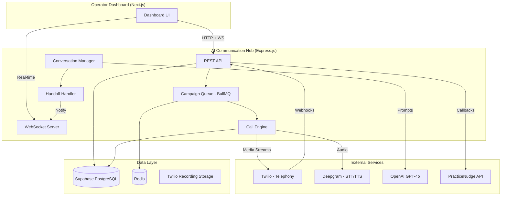
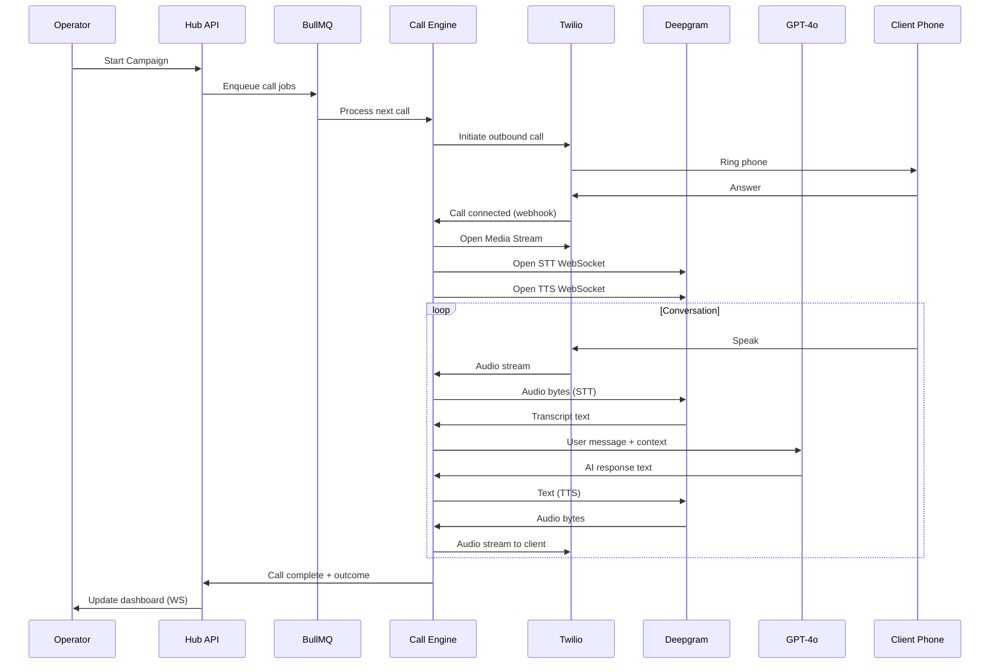

# Design Document: AI Communication Hub MVP

## Overview

The AI Communication Hub MVP is a standalone Node.js/TypeScript backend service that automates outbound voice calls for UK and Turkish accounting firms. It integrates with PracticeNudge to pull client data, uses AI to conduct document reminder conversations, and reports outcomes back.

**Key Design Decisions:**
- **Standalone service**: Deployed independently from PracticeNudge (separate repo, separate process)
- **Shared database**: Uses the same Supabase PostgreSQL instance as PracticeNudge for seamless data linking
- **Event-driven architecture**: BullMQ job queue orchestrates campaign execution, enabling pause/resume and retry logic
- **WebSocket for real-time**: Operator dashboard receives live updates (call progress, handoff notifications) via WebSocket
- **Modular voice pipeline**: Twilio (telephony) → Deepgram (STT/TTS) → GPT-4o (conversation) — each replaceable independently

**Scope Boundaries:**
- Outbound calls only (no inbound)
- Max 5 concurrent calls per campaign
- Max 20 clients per campaign CSV
- Single-tenant with multi-tenant-ready schema
- 2 voice personas: English UK, Turkish
- No billing, no email/SMS/WhatsApp channels

## Architecture

### High-Level System Architecture



### Call Flow Sequence



### Deployment Architecture

- **Runtime**: Node.js 20+ with TypeScript
- **Process**: Single Express.js server handling HTTP, WebSocket, and Twilio webhooks
- **Queue**: Redis instance for BullMQ (can be Redis Cloud or local)
- **Database**: Supabase PostgreSQL (shared instance with PracticeNudge, separate schema/tables)
- **Hosting**: Any VPS or cloud (Railway, Render, or EC2) — needs stable public URL for Twilio webhooks

## Components and Interfaces

### 1. REST API Layer (`/src/api/`)

Handles all HTTP endpoints for the operator dashboard and PracticeNudge integration.

```typescript
// Campaign endpoints
POST   /api/campaigns              // Create campaign (upload CSV or JSON payload)
POST   /api/campaigns/trigger      // PracticeNudge trigger endpoint
GET    /api/campaigns              // List campaigns
GET    /api/campaigns/:id          // Campaign details + progress
POST   /api/campaigns/:id/start    // Start campaign execution
POST   /api/campaigns/:id/pause    // Pause campaign
GET    /api/campaigns/:id/results  // Results summary
GET    /api/campaigns/:id/export   // CSV export

// Call endpoints
GET    /api/calls                  // Call history (filterable)
GET    /api/calls/:id              // Call detail + transcript
GET    /api/calls/:id/recording    // Signed URL to recording

// Handoff endpoints
GET    /api/handoffs/pending       // Current pending handoffs
POST   /api/handoffs/:id/accept    // Accept handoff
POST   /api/handoffs/:id/decline   // Decline handoff

// Twilio webhooks
POST   /api/webhooks/twilio/status // Call status updates
POST   /api/webhooks/twilio/stream // Media stream connection
POST   /api/webhooks/twilio/recording // Recording ready

// Health
GET    /api/health                 // Service health check
```

### 2. Campaign Queue (`/src/queue/`)

BullMQ-based job processing for campaign execution.

```typescript
interface CampaignJob {
  campaignId: string;
  clientId: string;
  clientName: string;
  phoneNumber: string;
  language: 'en-GB' | 'tr-TR';
  outstandingDocuments: DocumentContext[];
  firmName: string;
  attempt: number; // 1, 2, or 3
  retryAfter?: Date;
}

interface QueueConfig {
  concurrency: 5;          // Max concurrent calls
  maxRetries: 2;           // Retry unanswered calls
  retryDelay: 1800000;     // 30 minutes in ms
  callTimeout: 30000;      // 30s ring timeout
}
```

### 3. Call Engine (`/src/engine/`)

Manages the Twilio call lifecycle and audio streaming pipeline.

```typescript
interface CallEngine {
  initiateCall(job: CampaignJob): Promise<CallSession>;
  handleCallConnected(callSid: string): void;
  handleMediaStream(callSid: string, audioChunk: Buffer): void;
  endCall(callSid: string, reason: string): Promise<void>;
  transferCall(callSid: string, operatorPhone: string): Promise<void>;
}

interface CallSession {
  callSid: string;
  campaignId: string;
  clientId: string;
  status: 'ringing' | 'connected' | 'ended';
  startedAt: Date;
  sttStream: DeepgramSTTStream;
  ttsStream: DeepgramTTSStream;
  conversationManager: ConversationManager;
  recordingSid?: string;
}
```

### 4. Conversation Manager (`/src/conversation/`)

Orchestrates the AI dialogue using GPT-4o with the document reminder playbook.

```typescript
interface ConversationManager {
  initialize(context: CallContext): void;
  handleUserUtterance(text: string): Promise<AIResponse>;
  shouldHandoff(): boolean;
  getOutcome(): CallOutcome;
  getConversationSummary(): string;
}

interface CallContext {
  clientName: string;
  firmName: string;
  language: 'en-GB' | 'tr-TR';
  outstandingDocuments: DocumentContext[];
  playbook: PlaybookConfig;
}

interface AIResponse {
  text: string;
  action?: 'continue' | 'handoff' | 'end_call';
  outcomeUpdate?: Partial<CallOutcome>;
}

interface CallOutcome {
  type: 'document_promised' | 'refused' | 'no_answer' | 'voicemail' | 'handoff_completed' | 'handoff_missed';
  clientResponseSummary: string;
  commitments: string[];
  reason?: string;
  duration: number;
}
```

### 5. Speech Pipeline (`/src/speech/`)

Wraps Deepgram STT and TTS with buffering and utterance detection.

```typescript
interface STTStream {
  start(language: 'en-GB' | 'tr-TR'): void;
  feedAudio(chunk: Buffer): void;
  onTranscript(callback: (text: string, isFinal: boolean) => void): void;
  onUtteranceEnd(callback: () => void): void;
  close(): void;
}

interface TTSStream {
  synthesize(text: string, voice: VoicePersona): Promise<Buffer>;
  streamSynthesize(text: string, voice: VoicePersona, onChunk: (audio: Buffer) => void): void;
  close(): void;
}

interface VoicePersona {
  id: string;
  language: 'en-GB' | 'tr-TR';
  deepgramModel: string;    // e.g., 'aura-asteria-en' or Turkish model
  displayName: string;
  description: string;
}
```

### 6. Handoff Handler (`/src/handoff/`)

Manages the human handoff flow including notifications and call transfer.

```typescript
interface HandoffHandler {
  requestHandoff(callSession: CallSession, reason: string): Promise<HandoffRequest>;
  acceptHandoff(handoffId: string, operatorPhone: string): Promise<void>;
  declineHandoff(handoffId: string): Promise<void>;
  checkTimeout(handoffId: string): Promise<void>; // 30s timeout
}

interface HandoffRequest {
  id: string;
  callSid: string;
  clientName: string;
  conversationSummary: string;
  reason: string;
  status: 'pending' | 'accepted' | 'declined' | 'timeout';
  createdAt: Date;
  expiresAt: Date; // createdAt + 30s
}
```

### 7. PracticeNudge Integration (`/src/integration/`)

Handles bidirectional data flow with PracticeNudge.

```typescript
interface PracticeNudgeClient {
  // Pull client data (via shared DB or API)
  getClientContext(clientId: string): Promise<ClientContext>;
  
  // Push outcomes back
  reportCallOutcome(payload: OutcomePayload): Promise<void>;
  
  // Check if client still needs calling
  isClientStillPending(clientId: string): Promise<boolean>;
}

interface OutcomePayload {
  practiceNudgeClientId: string;
  callOutcome: CallOutcome;
  callId: string;
  timestamp: Date;
  recordingUrl?: string;
  transcriptUrl?: string;
}
```

### 8. WebSocket Server (`/src/ws/`)

Real-time updates to the operator dashboard.

```typescript
// Events emitted to dashboard
type WSEvent =
  | { type: 'campaign_progress'; data: CampaignProgress }
  | { type: 'call_started'; data: { callId: string; clientName: string } }
  | { type: 'call_ended'; data: { callId: string; outcome: CallOutcome } }
  | { type: 'handoff_requested'; data: HandoffRequest }
  | { type: 'handoff_resolved'; data: { handoffId: string; status: string } };
```

## Data Models

### Database Schema (Supabase PostgreSQL)

```sql
-- Campaigns table
CREATE TABLE campaigns (
  id UUID PRIMARY KEY DEFAULT gen_random_uuid(),
  tenant_id UUID NOT NULL,
  name VARCHAR(255) NOT NULL,
  status VARCHAR(20) NOT NULL DEFAULT 'ready', -- ready, running, paused, completed
  voice_persona_id VARCHAR(50) NOT NULL,
  total_calls INTEGER NOT NULL DEFAULT 0,
  completed_calls INTEGER NOT NULL DEFAULT 0,
  created_at TIMESTAMPTZ NOT NULL DEFAULT NOW(),
  started_at TIMESTAMPTZ,
  completed_at TIMESTAMPTZ,
  created_by UUID NOT NULL
);

-- Campaign recipients (from CSV upload)
CREATE TABLE campaign_recipients (
  id UUID PRIMARY KEY DEFAULT gen_random_uuid(),
  campaign_id UUID NOT NULL REFERENCES campaigns(id),
  client_name VARCHAR(255) NOT NULL,
  phone_number VARCHAR(50) NOT NULL,
  language VARCHAR(10) NOT NULL DEFAULT 'en-GB', -- en-GB or tr-TR
  outstanding_documents JSONB NOT NULL DEFAULT '[]',
  deadline_date DATE,
  practicenudge_client_id UUID, -- link to PN client
  status VARCHAR(20) NOT NULL DEFAULT 'pending', -- pending, calling, completed, skipped
  attempt_count INTEGER NOT NULL DEFAULT 0,
  next_retry_at TIMESTAMPTZ,
  created_at TIMESTAMPTZ NOT NULL DEFAULT NOW()
);

-- Call records
CREATE TABLE calls (
  id UUID PRIMARY KEY DEFAULT gen_random_uuid(),
  campaign_id UUID NOT NULL REFERENCES campaigns(id),
  recipient_id UUID NOT NULL REFERENCES campaign_recipients(id),
  twilio_call_sid VARCHAR(100),
  status VARCHAR(20) NOT NULL DEFAULT 'initiated', -- initiated, ringing, connected, ended
  outcome VARCHAR(30), -- document_promised, refused, no_answer, voicemail, handoff_completed, handoff_missed
  outcome_details JSONB, -- { summary, commitments, reason }
  duration_seconds INTEGER,
  recording_url TEXT,
  recording_sid VARCHAR(100),
  transcript TEXT,
  transcript_ready_at TIMESTAMPTZ,
  started_at TIMESTAMPTZ NOT NULL DEFAULT NOW(),
  connected_at TIMESTAMPTZ,
  ended_at TIMESTAMPTZ
);

-- Handoff requests
CREATE TABLE handoff_requests (
  id UUID PRIMARY KEY DEFAULT gen_random_uuid(),
  call_id UUID NOT NULL REFERENCES calls(id),
  operator_id UUID,
  client_name VARCHAR(255) NOT NULL,
  conversation_summary TEXT NOT NULL,
  reason VARCHAR(500) NOT NULL,
  status VARCHAR(20) NOT NULL DEFAULT 'pending', -- pending, accepted, declined, timeout
  operator_phone VARCHAR(50),
  created_at TIMESTAMPTZ NOT NULL DEFAULT NOW(),
  expires_at TIMESTAMPTZ NOT NULL,
  resolved_at TIMESTAMPTZ
);

-- Voice personas (seeded data)
CREATE TABLE voice_personas (
  id VARCHAR(50) PRIMARY KEY,
  language VARCHAR(10) NOT NULL,
  display_name VARCHAR(100) NOT NULL,
  description TEXT,
  deepgram_model VARCHAR(100) NOT NULL,
  deepgram_stt_model VARCHAR(100) NOT NULL,
  is_active BOOLEAN NOT NULL DEFAULT true
);

-- Indexes
CREATE INDEX idx_campaigns_tenant ON campaigns(tenant_id);
CREATE INDEX idx_campaigns_status ON campaigns(status);
CREATE INDEX idx_recipients_campaign ON campaign_recipients(campaign_id);
CREATE INDEX idx_recipients_status ON campaign_recipients(campaign_id, status);
CREATE INDEX idx_calls_campaign ON calls(campaign_id);
CREATE INDEX idx_calls_recipient ON calls(recipient_id);
CREATE INDEX idx_handoffs_status ON handoff_requests(status);
CREATE INDEX idx_handoffs_expires ON handoff_requests(expires_at) WHERE status = 'pending';
```

### Redis Data Structures

```
# Active call sessions (TTL: 1 hour)
call_session:{callSid} → JSON(CallSession)

# Campaign progress counters
campaign_progress:{campaignId} → Hash { completed, in_progress, remaining, outcomes }

# Handoff timeout tracking
handoff_timeout:{handoffId} → expires in 30s (BullMQ delayed job)

# Rate limiting
rate_limit:{tenantId} → counter (max 5 concurrent)
```

### Seed Data: Voice Personas

```json
[
  {
    "id": "en-gb-professional",
    "language": "en-GB",
    "display_name": "English (UK Professional)",
    "description": "Clear, professional British English voice suitable for business calls",
    "deepgram_model": "aura-asteria-en",
    "deepgram_stt_model": "nova-2",
    "is_active": true
  },
  {
    "id": "tr-professional",
    "language": "tr-TR",
    "display_name": "Turkish (Professional)",
    "description": "Clear, professional Turkish voice suitable for business calls",
    "deepgram_model": "aura-asteria-tr",
    "deepgram_stt_model": "nova-2",
    "is_active": true
  }
]
```

## Correctness Properties

*A property is a characteristic or behavior that should hold true across all valid executions of a system — essentially, a formal statement about what the system should do. Properties serve as the bridge between human-readable specifications and machine-verifiable correctness guarantees.*

### Property 1: CSV Validation Produces Valid Campaigns

*For any* CSV payload containing rows with client names, phone numbers, and document details, if all rows pass validation (valid phone format, non-empty name, ≤20 rows), the system SHALL create a campaign in 'ready' status with the correct number of recipients; if any row is invalid, the system SHALL reject the entire CSV and not create a campaign.

**Validates: Requirements 1.1**

### Property 2: Campaign Concurrency Invariant

*For any* campaign with N recipients (1 ≤ N ≤ 20), the number of simultaneously active calls SHALL never exceed 5 at any point during campaign execution.

**Validates: Requirements 1.2**

### Property 3: Campaign Summary Accuracy

*For any* set of call outcomes belonging to a campaign, the generated summary SHALL have: total_calls equal to the count of all call records, each outcome category count equal to the number of calls with that outcome, and success_rate equal to (document_promised count / total completed calls).

**Validates: Requirements 1.5**

### Property 4: Retry Policy Invariant

*For any* call recipient, the total number of call attempts SHALL never exceed 3 (1 initial + 2 retries), and each retry SHALL be scheduled at least 30 minutes after the previous attempt.

**Validates: Requirements 1.6**

### Property 5: Conversation Context Completeness

*For any* call context containing a client name, firm name, and list of outstanding documents, the AI conversation prompt SHALL include the client's name, the firm's name, and every document name and deadline from the outstanding documents list.

**Validates: Requirements 2.1, 2.2**

### Property 6: Handoff Trigger Threshold

*For any* conversation sequence, the system SHALL trigger a human handoff if and only if the unresolved question counter reaches exactly 2. Conversations with fewer than 2 unresolved questions SHALL NOT trigger handoff.

**Validates: Requirements 2.5**

### Property 7: Outcome Record Completeness

*For any* completed call, the outcome record SHALL contain all required fields: outcome type (one of the valid enum values), client response summary (non-empty string), and commitments array (may be empty but must be present).

**Validates: Requirements 2.6**

### Property 8: Handoff Notification Completeness

*For any* handoff request, the notification payload SHALL contain: client name, conversation summary (non-empty), and reason for handoff (non-empty).

**Validates: Requirements 4.1**

### Property 9: Operator Handoff Queue Limit

*For any* operator, the number of pending (unresolved) handoff requests assigned to that operator SHALL never exceed 1.

**Validates: Requirements 4.5**

### Property 10: Data Linking Integrity

*For any* call record created from a campaign recipient that has a PracticeNudge client ID, the call record SHALL maintain the correct campaign_id, recipient_id, and the recipient's practicenudge_client_id SHALL be accessible from the call record through the recipient relationship.

**Validates: Requirements 5.3, 6.3**

### Property 11: Client Context Preservation

*For any* valid client context payload (containing client name, phone number, documents list, and deadline dates), after storing as a campaign recipient, reading back the recipient record SHALL return identical values for all fields.

**Validates: Requirements 6.1**

### Property 12: Skip Logic Correctness

*For any* campaign recipient, a skip signal SHALL only take effect if the recipient's status is 'pending'. Recipients with status 'calling', 'completed', or 'skipped' SHALL not be affected by skip signals.

**Validates: Requirements 6.5**

### Property 13: Campaign Progress Consistency

*For any* campaign state, the progress numbers SHALL satisfy: completed + in_progress + remaining = total_calls, and each value SHALL be non-negative.

**Validates: Requirements 7.2**

### Property 14: CSV Export Completeness

*For any* set of campaign call results, the exported CSV SHALL contain exactly one row per call, and each row SHALL include all required columns (client name, phone, outcome, duration, summary, timestamp) with values matching the source call records.

**Validates: Requirements 7.5**

### Property 15: Voice Persona Consistency

*For any* sequence of TTS synthesis requests within a single call session, all requests SHALL use the same voice persona (same deepgram_model) as was configured at call initiation.

**Validates: Requirements 8.3**

### Property 16: Language Resolution Priority

*For any* campaign recipient, the resolved language SHALL be the recipient's per-client language override if present, otherwise the campaign-level voice persona language. This resolution SHALL be deterministic and consistent.

**Validates: Requirements 1.3, 8.4**

## Error Handling

### Call-Level Errors

| Error Scenario | Handling Strategy |
|---|---|
| Twilio API failure (call initiation) | Retry with exponential backoff (3 attempts, 5s/15s/45s). Mark as 'failed' after exhaustion. |
| Deepgram STT connection drop | Attempt reconnect within 3s. If fails, end call gracefully with apology message, mark as 'technical_error'. |
| Deepgram TTS failure | Fall back to cached "please hold" audio. Retry TTS. If persistent, trigger handoff. |
| OpenAI API timeout (>5s) | Retry once. If second attempt fails, use fallback response: "I'm sorry, could you repeat that?" |
| OpenAI API rate limit | Queue response, apply backoff. If >10s total delay, apologize and offer callback. |
| Client hangs up mid-conversation | Record partial outcome, mark call as 'ended_by_client', save transcript up to that point. |
| Invalid phone number (Twilio rejects) | Mark recipient as 'invalid_number', skip retries, continue campaign. |

### Campaign-Level Errors

| Error Scenario | Handling Strategy |
|---|---|
| Redis connection lost | Pause campaign, notify operator via stored WebSocket state. Resume when Redis reconnects. |
| Database connection lost | Pause all active campaigns. Buffer call outcomes in Redis. Flush to DB on reconnect. |
| All 5 concurrent slots stuck (calls not ending) | 5-minute timeout per call. Force-end stuck calls, mark as 'timeout'. |
| Operator dashboard disconnects | Buffer WebSocket events. Replay on reconnect. Handoff timeouts still apply. |

### Data Validation Errors

| Error Scenario | Handling Strategy |
|---|---|
| CSV with invalid phone format | Reject entire CSV with specific row/column error messages. |
| CSV exceeds 20 recipients | Reject with message: "MVP supports up to 20 recipients per campaign." |
| Missing required CSV columns | Reject with list of missing columns. |
| PracticeNudge API unreachable | Allow campaign creation from CSV only. Queue outcome callbacks for retry. |
| Duplicate phone numbers in CSV | Deduplicate and warn operator. Keep first occurrence. |

### Security Considerations

- **API Authentication**: JWT-based auth for dashboard API. API key for PracticeNudge integration endpoint.
- **Twilio Webhook Validation**: Verify `X-Twilio-Signature` header on all webhook requests.
- **Recording Access**: Signed URLs with 1-hour expiry for recording playback.
- **Rate Limiting**: Max 5 concurrent calls per tenant. Max 10 campaigns per day per tenant.
- **Data Encryption**: All data at rest encrypted by Supabase. TLS for all API communication.

## Testing Strategy

### Unit Tests (Jest/Vitest)

Focus on pure business logic:
- CSV validation logic (format checking, field validation, deduplication)
- Campaign state machine transitions (ready → running → paused → completed)
- Outcome classification logic
- Retry scheduling logic
- Language resolution logic
- Campaign summary calculation
- Progress counter arithmetic
- Handoff timeout logic

### Property-Based Tests (fast-check)

**Library**: [fast-check](https://github.com/dubzzz/fast-check) for TypeScript property-based testing.

**Configuration**: Minimum 100 iterations per property test.

Each property test maps to a Correctness Property above:
- **Property 1**: Generate random CSV payloads → verify validation correctness
- **Property 2**: Simulate campaign execution → verify concurrency ≤ 5
- **Property 3**: Generate random outcome sets → verify summary math
- **Property 4**: Generate retry sequences → verify attempt count ≤ 3 and timing
- **Property 5**: Generate random client contexts → verify prompt completeness
- **Property 6**: Generate conversation sequences → verify handoff threshold
- **Property 7**: Generate call completions → verify outcome record structure
- **Property 8**: Generate handoff scenarios → verify notification payload
- **Property 9**: Generate handoff request sequences → verify queue limit
- **Property 10**: Generate call records with PN IDs → verify linking
- **Property 11**: Generate client contexts → verify round-trip preservation
- **Property 12**: Generate recipients in various states + skip signals → verify skip logic
- **Property 13**: Generate campaign states → verify progress arithmetic
- **Property 14**: Generate call results → verify CSV export completeness
- **Property 15**: Generate TTS request sequences → verify persona consistency
- **Property 16**: Generate recipients with/without overrides → verify resolution

**Tag format**: `Feature: ai-communication-hub, Property {N}: {title}`

### Integration Tests

- Twilio webhook handling (mock Twilio signatures)
- Deepgram STT/TTS connection lifecycle (mock WebSocket)
- OpenAI conversation flow (mock API responses)
- BullMQ job processing (real Redis, test queue)
- PracticeNudge callback delivery (mock HTTP endpoint)
- WebSocket event delivery to dashboard
- Full campaign lifecycle (create → start → calls → complete)

### End-to-End Tests

- Create campaign via API → verify calls are initiated (Twilio test credentials)
- Complete a call → verify outcome stored and callback sent
- Trigger handoff → verify notification and timeout behavior
- Export campaign results → verify CSV content

### Test Environment

- **Unit/Property tests**: No external dependencies, all mocked
- **Integration tests**: Real Redis, mocked external APIs (Twilio, Deepgram, OpenAI)
- **E2E tests**: Twilio test credentials, Deepgram sandbox, real database

