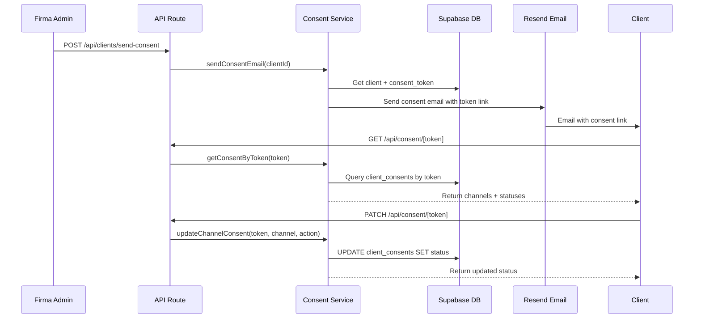

# Design Document: GDPR Channel-Based Consent

## Overview

Bu tasarım, mevcut tek boolean GDPR onay sistemini kanal bazlı (email/sms) bağımsız onay yapısına dönüştürür. Mevcut `clients` tablosundaki `gdpr_consent` boolean alanı yerine yeni bir `client_consents` tablosu kullanılarak her iletişim kanalı için ayrı onay durumu (pending/accepted/rejected) takip edilir.

**Temel Değişiklikler:**
- Yeni `client_consents` tablosu ile kanal bazlı onay yönetimi
- Consent sayfasının kanal bazlı accept/reject UI'a dönüştürülmesi
- Notification servisine consent kontrolü eklenmesi
- Firma panelinde kanal bazlı onay durumu görüntüleme
- Mevcut boolean verinin yeni yapıya migrasyonu

**Teknoloji Stack:**
- Next.js 14 (App Router)
- Supabase (PostgreSQL + RLS)
- Resend (email gönderimi)
- TypeScript
- Vitest + fast-check (test)

## Architecture

```mermaid
graph TD
    subgraph "Client-Facing"
        CP[Consent Page<br/>/consent/[token]]
    end

    subgraph "Firm Dashboard"
        CD[Client Detail Page]
        CL[Client List]
        SC[Send Consent Button]
    end

    subgraph "API Routes"
        A1[GET /api/consent/[token]]
        A2[PATCH /api/consent/[token]]
        A3[POST /api/clients/send-consent]
    end

    subgraph "Services"
        CS[Consent Service<br/>src/lib/consent/service.ts]
        NS[Notification Service<br/>src/lib/notifications/service.ts]
        ES[Email Service<br/>src/lib/email/gdpr-consent.ts]
    end

    subgraph "Database"
        CC[(client_consents)]
        CL2[(clients)]
    end

    CP --> A1
    CP --> A2
    SC --> A3
    CD --> CS
    A1 --> CS
    A2 --> CS
    A3 --> CS
    A3 --> ES
    CS --> CC
    NS --> CS
    CS --> CL2
```

### Akış Diyagramı: Consent İşlemi



## Components and Interfaces

### 1. Consent Service (`src/lib/consent/service.ts`)

Kanal bazlı onay işlemlerinin merkezi servisi.

```typescript
// Types
export type ConsentChannel = "email" | "sms";
export type ConsentStatus = "pending" | "accepted" | "rejected";

export interface ClientConsent {
  id: string;
  client_id: string;
  channel: ConsentChannel;
  status: ConsentStatus;
  consent_token: string;
  created_at: string;
  updated_at: string;
}

export interface ConsentPageData {
  clientName: string;
  firmName: string;
  channels: Array<{
    channel: ConsentChannel;
    status: ConsentStatus;
    hasContactInfo: boolean;
    description: string;
  }>;
}

// Service Functions
export async function createConsentsForClient(clientId: string): Promise<ClientConsent[]>;
export async function getConsentsByToken(token: string): Promise<ConsentPageData | null>;
export async function updateChannelConsent(
  token: string,
  channel: ConsentChannel,
  action: "accept" | "reject"
): Promise<ClientConsent>;
export async function getClientConsents(clientId: string): Promise<ClientConsent[]>;
export async function checkChannelConsent(
  clientId: string,
  channel: ConsentChannel
): Promise<boolean>;
export async function getConsentStatusLabel(status: ConsentStatus): string;
export async function formatConsentDate(date: string): string;
```

### 2. Updated Notification Service (`src/lib/notifications/service.ts`)

Mevcut `sendNotification` fonksiyonuna consent kontrolü eklenir.

```typescript
// New function added to notification service
async function checkConsentBeforeSend(
  clientId: string,
  channel: NotificationChannel
): Promise<{ allowed: boolean; reason?: string }>;
```

### 3. API Routes

#### `GET /api/consent/[token]` (Updated)
- Token ile client consent bilgilerini döndürür
- Tüm kanalları ve durumlarını listeler
- Client/firma adını içerir

#### `PATCH /api/consent/[token]` (New)
- Body: `{ channel: ConsentChannel, action: "accept" | "reject" }`
- Belirtilen kanalın durumunu günceller
- Güncellenmiş consent kaydını döndürür

#### `POST /api/clients/send-consent` (Updated)
- Mevcut token'ı kullanarak consent e-postası gönderir
- Email adresi kontrolü yapar

### 4. Consent Page Component (`src/app/consent/[token]/page.tsx`)

Mevcut tek butonlu consent sayfası, kanal bazlı accept/reject UI'a dönüştürülür.

```typescript
// Component State
interface ConsentPageState {
  loading: boolean;
  notFound: boolean;
  clientName: string;
  firmName: string;
  channels: Array<{
    channel: ConsentChannel;
    status: ConsentStatus;
    hasContactInfo: boolean;
    description: string;
    updating: boolean;
    error: string | null;
  }>;
}
```

### 5. Client Detail Consent Section (`src/components/consent-status.tsx`)

Firma panelinde client detay sayfasında gösterilecek consent durumu bileşeni.

```typescript
interface ConsentStatusProps {
  clientId: string;
}

// Displays per-channel consent status with labels and dates
export function ConsentStatusSection({ clientId }: ConsentStatusProps): JSX.Element;
```

## Data Models

### New Table: `client_consents`

```sql
CREATE TABLE client_consents (
  id UUID PRIMARY KEY DEFAULT gen_random_uuid(),
  client_id UUID NOT NULL REFERENCES clients(id) ON DELETE CASCADE,
  channel TEXT NOT NULL CHECK (channel IN ('email', 'sms')),
  status TEXT NOT NULL DEFAULT 'pending' CHECK (status IN ('pending', 'accepted', 'rejected')),
  consent_token UUID NOT NULL,
  created_at TIMESTAMPTZ DEFAULT now(),
  updated_at TIMESTAMPTZ DEFAULT now(),
  UNIQUE(client_id, channel)
);

-- Indexes
CREATE INDEX idx_client_consents_client_id ON client_consents(client_id);
CREATE INDEX idx_client_consents_token ON client_consents(consent_token);
CREATE INDEX idx_client_consents_status ON client_consents(status);

-- RLS
ALTER TABLE client_consents ENABLE ROW LEVEL SECURITY;

-- Firm users can view their clients' consents
CREATE POLICY "Users can view firm client consents" ON client_consents
  FOR SELECT USING (
    client_id IN (
      SELECT id FROM clients
      WHERE firm_id IN (SELECT firm_id FROM firm_users WHERE user_id = auth.uid())
    )
  );

-- Public access via consent_token (for consent page)
CREATE POLICY "Public can view consent by token" ON client_consents
  FOR SELECT USING (true);

CREATE POLICY "Public can update consent by token" ON client_consents
  FOR UPDATE USING (true);
```

### TypeScript Type

```typescript
export type ClientConsent = {
  id: string;
  client_id: string;
  channel: "email" | "sms";
  status: "pending" | "accepted" | "rejected";
  consent_token: string;
  created_at: string;
  updated_at: string;
};
```

### Migration Strategy

```sql
-- Migration: 014_channel_consent.sql

-- 1. Create new table
CREATE TABLE client_consents ( ... );

-- 2. Migrate existing data
INSERT INTO client_consents (client_id, channel, status, consent_token, updated_at)
SELECT
  c.id,
  ch.channel,
  CASE
    WHEN c.gdpr_consent = true THEN 'accepted'
    ELSE 'pending'
  END,
  COALESCE(c.gdpr_consent_token, gen_random_uuid()::text)::uuid,
  COALESCE(c.gdpr_consented_at, now())
FROM clients c
CROSS JOIN (VALUES ('email'), ('sms')) AS ch(channel)
WHERE NOT EXISTS (
  SELECT 1 FROM client_consents cc
  WHERE cc.client_id = c.id AND cc.channel = ch.channel
);

-- 3. Keep old columns for backward compatibility (do NOT drop)
```

### Consent Token Design

- Her client için tek bir `consent_token` (UUID) kullanılır
- Token, `client_consents` tablosunda `consent_token` sütununda saklanır
- Aynı client'ın tüm kanal kayıtları aynı token'ı paylaşır
- Mevcut `gdpr_consent_token` değeri migrasyon sırasında yeni tabloya aktarılır

## Correctness Properties

*A property is a characteristic or behavior that should hold true across all valid executions of a system — essentially, a formal statement about what the system should do. Properties serve as the bridge between human-readable specifications and machine-verifiable correctness guarantees.*

### Property 1: Client creation initializes all channels in pending state

*For any* newly created client, the consent service SHALL create exactly one consent record per channel (email, sms) with status "pending", and the total number of consent records for that client SHALL equal the number of supported channels.

**Validates: Requirements 1.3**

### Property 2: Unique client-channel constraint

*For any* client and channel combination, attempting to create a duplicate consent record SHALL be rejected (idempotent), and the existing record SHALL remain unchanged in all fields.

**Validates: Requirements 1.6**

### Property 3: Consent status transition correctness

*For any* consent record regardless of its current status, accepting it SHALL set status to "accepted" and rejecting it SHALL set status to "rejected", and in both cases the updated_at timestamp SHALL be greater than or equal to the previous updated_at.

**Validates: Requirements 2.3, 2.4**

### Property 4: Channel consent gate for notifications

*For any* client and channel where the consent status is NOT "accepted" (pending or rejected), the notification service SHALL block the notification and return a "consent_not_granted" error code with the channel name and client ID in the log.

**Validates: Requirements 4.1, 4.2, 4.3, 4.4**

### Property 5: Consent email contains all required information

*For any* valid client name, firm name, and consent token, the generated consent email content SHALL contain the client name, firm name, and a valid consent link that includes the token.

**Validates: Requirements 3.1, 3.2**

### Property 6: Consent token reuse on resend

*For any* client with an existing consent token, resending the consent email SHALL use the same token value (not generate a new one), ensuring the consent link remains stable.

**Validates: Requirements 3.7**

### Property 7: Migration maps boolean consent to channel statuses

*For any* client with gdpr_consent=true, migration SHALL set all channels to "accepted". *For any* client with gdpr_consent=false or NULL, migration SHALL set all channels to "pending". The gdpr_consented_at date SHALL be preserved as the updated_at of the channel records.

**Validates: Requirements 1.5, 6.1, 6.2, 6.3, 6.4**

### Property 8: Migration idempotency

*For any* set of clients, running the migration function twice SHALL produce the same result as running it once — existing channel records SHALL not be modified, and only missing records SHALL be created.

**Validates: Requirements 6.8**

### Property 9: Status label mapping

*For any* consent status value, the label mapping function SHALL return "Onay Bekleniyor" for "pending", "Onaylandı" for "accepted", and "Reddedildi" for "rejected" — and no other values SHALL be accepted.

**Validates: Requirements 5.2, 5.3, 5.4**

### Property 10: Date formatting

*For any* valid ISO date string, the format function SHALL produce a string matching the dd/MM/yyyy pattern where day is zero-padded 01-31, month is zero-padded 01-12, and year is 4 digits.

**Validates: Requirements 5.5**

### Property 11: Disabled channel when contact info missing

*For any* client where the email address is null/empty, the consent page data for the email channel SHALL have `hasContactInfo: false`. Similarly, *for any* client where the phone number is null/empty, the sms channel SHALL have `hasContactInfo: false`.

**Validates: Requirements 2.9**

## Error Handling

| Senaryo | Davranış | Hata Kodu/Mesaj |
|---------|----------|-----------------|
| Geçersiz consent token | 404 döndür, form gizle | "Invalid or expired link" |
| Kanal güncelleme hatası | Mevcut durumu koru, hata mesajı göster | HTTP 500 + error message |
| Email adresi eksik (consent gönderimi) | Email gönderme, hata döndür | "Client has no email address" |
| Email gönderim hatası | Firma admin'e hata göster | "Failed to send consent email" |
| Consent kaydı bulunamayan bildirim | Bildirimi engelle, log yaz | "consent_record_missing" |
| Consent verilmemiş bildirim | Bildirimi engelle, log yaz | "consent_not_granted" |
| Consent verileri yüklenemez (firma paneli) | Hata mesajı göster, client bilgilerini koru | "Failed to load consent data" |
| Migrasyon hatası | Tüm değişiklikleri rollback et | "Migration failed for client: {id}" |
| Mükerrer kanal kaydı oluşturma | Sessizce yoksay, mevcut kaydı koru | No error (idempotent) |

### Error Handling Strategy

1. **API Routes**: Try-catch ile sarılır, uygun HTTP status kodları döndürülür
2. **Service Layer**: Hataları fırlatır, API route'lar yakalar
3. **UI Components**: Loading/error state'leri ile kullanıcıya bilgi verilir
4. **Database**: Constraint violations (unique, check) Supabase error olarak döner
5. **Migration**: Tek transaction içinde, herhangi bir hata tüm işlemi geri alır

## Testing Strategy

### Property-Based Tests (Vitest + fast-check)

Property-based testler, correctness properties bölümündeki her property için yazılır. Minimum 100 iterasyon ile çalıştırılır.

**Test Dosyası:** `src/lib/consent/__tests__/consent.property.test.ts`

- Property 1: Client creation → channel initialization
- Property 2: Duplicate record idempotency
- Property 3: Status transition correctness
- Property 4: Notification consent gate
- Property 5: Email content completeness
- Property 6: Token reuse on resend
- Property 7: Migration boolean-to-channel mapping
- Property 8: Migration idempotency
- Property 9: Status label mapping
- Property 10: Date formatting
- Property 11: Disabled channel for missing contact info

**Konfigürasyon:**
- Library: `fast-check` (already in devDependencies)
- Runner: `vitest`
- Iterations: minimum 100 per property
- Tag format: `Feature: gdpr-channel-consent, Property {N}: {description}`

### Unit Tests (Example-Based)

**Test Dosyası:** `src/lib/consent/__tests__/consent.test.ts`

- Consent page renders all channels (2.1)
- Accept/reject buttons exist per channel (2.2)
- UI reflects updated status within timeout (2.5)
- Error display on update failure (2.6)
- Client name and firm name displayed (2.7)
- Channel description text present (2.8)
- Invalid token shows error page (3.4)
- Missing email prevents consent send (3.5)
- Email send failure shows error (3.6)
- Missing consent record returns error (4.5)
- Consent blocked logs reason (4.6)
- Client detail shows consent per channel (5.1)
- Missing consent records show pending (5.6)
- Data load failure shows error (5.7)

### Integration Tests

- Auto-send consent email on client creation (3.3)
- Migration runs in single transaction (6.6)
- Migration rollback on failure (6.7)
- Old columns preserved after migration (6.5)

### Test Architecture

```
src/lib/consent/
├── __tests__/
│   ├── consent.property.test.ts   # Property-based tests
│   ├── consent.test.ts            # Unit tests
│   └── consent.integration.test.ts # Integration tests
├── service.ts                      # Core consent logic
├── types.ts                        # Type definitions
└── utils.ts                        # Helper functions (label mapping, date format)
```
