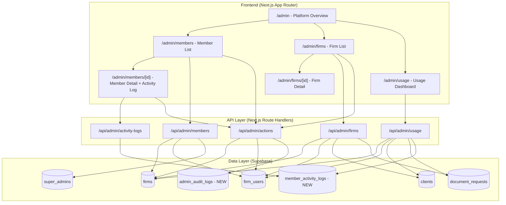
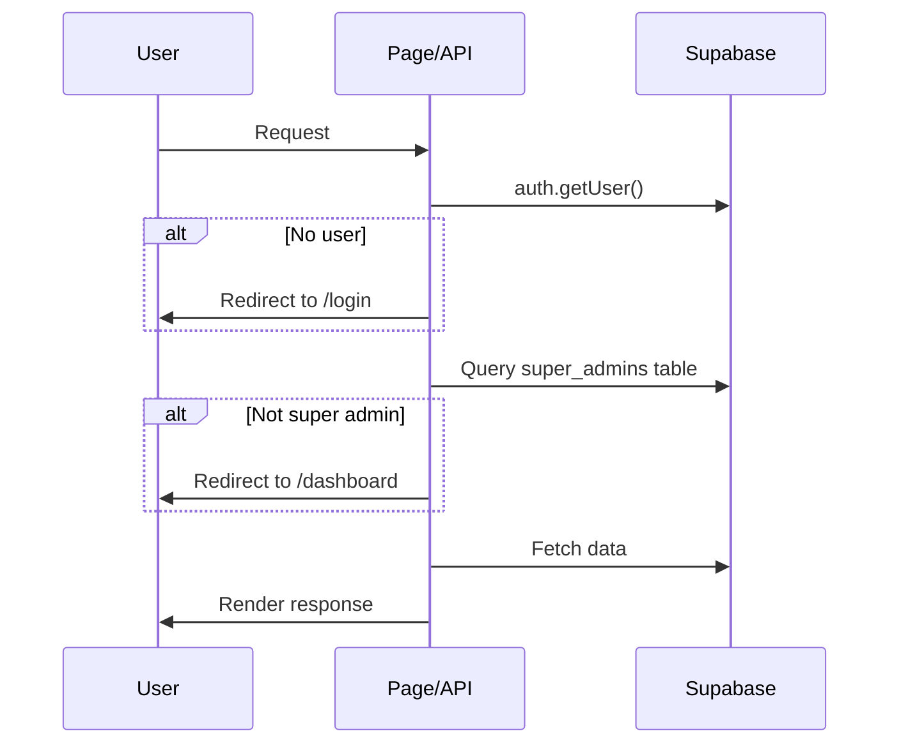

# Design Document: Super Admin Panel

## Overview

The Super Admin Panel extends PracticeNudge's existing admin section into a comprehensive platform management interface. It provides super administrators with full member lifecycle management, firm management, usage analytics, activity auditing, and a platform overview dashboard.

The current admin page (`/admin`) already implements basic firm/user listing and plan management with super admin verification via the `super_admins` table. This design builds upon that foundation, adding dedicated sub-pages for members, firms, usage analytics, and activity logs while maintaining the existing authentication and authorization patterns.

### Key Design Decisions

1. **Client-side rendering with API routes** — Consistent with the existing admin pages which use `"use client"` components fetching data via Supabase client or API routes.
2. **Supabase as the data layer** — All queries go through the existing Supabase client (`@supabase/ssr`), leveraging Row Level Security where applicable and super admin checks in API routes.
3. **Incremental enhancement** — The existing `/admin` page becomes the Platform Overview Dashboard (Requirement 7), with new sub-routes for members, firms, and usage.
4. **Shared UI components** — Leverages existing shadcn/ui components (Table, Card, Badge, Select, Dialog, Tabs) already in the project.

## Architecture



### Route Structure

| Route | Purpose | Requirement |
|-------|---------|-------------|
| `/admin` | Platform Overview Dashboard | Req 7 |
| `/admin/members` | Member listing with search/filter | Req 1 |
| `/admin/members/[id]` | Member detail + activity log | Req 2, 5 |
| `/admin/firms` | Firm listing with search/filter | Req 3 |
| `/admin/firms/[id]` | Firm detail view | Req 3 |
| `/admin/usage` | Usage Analytics Dashboard | Req 4 |

### Authentication Flow

Every admin page and API route follows this pattern (already established in the codebase):



## Components and Interfaces

### Page Components

```typescript
// src/app/(dashboard)/admin/page.tsx — Enhanced Platform Overview
// src/app/(dashboard)/admin/members/page.tsx — Member List
// src/app/(dashboard)/admin/members/[id]/page.tsx — Member Detail
// src/app/(dashboard)/admin/firms/page.tsx — Firm List  
// src/app/(dashboard)/admin/firms/[id]/page.tsx — Firm Detail
// src/app/(dashboard)/admin/usage/page.tsx — Usage Dashboard
```

### Shared Admin Components

```typescript
// src/components/admin/admin-guard.tsx
// Wraps admin pages with auth check, provides loading/redirect logic

// src/components/admin/confirmation-dialog.tsx
// Reusable confirmation dialog for destructive actions

// src/components/admin/pagination.tsx
// Reusable pagination component with page size and navigation

// src/components/admin/search-input.tsx
// Debounced search input (500ms) with minimum 2-character threshold

// src/components/admin/stat-card.tsx
// Clickable summary card for dashboard metrics

// src/components/admin/activity-log-table.tsx
// Activity log display with filtering and formatting

// src/components/admin/trend-chart.tsx
// Line chart for daily active members and document requests
```

### API Route Interfaces

```typescript
// GET /api/admin/members
interface MembersListRequest {
  page?: number;           // default: 1
  page_size?: number;      // default: 20, max: 100
  search?: string;         // min 2 chars, matches name/email/firm
  firm_id?: string;        // filter by firm
  role?: "owner" | "admin" | "member";
  plan?: "free" | "starter" | "pro";
  status?: "active" | "suspended";
  sort_by?: string;        // column name
  sort_order?: "asc" | "desc";
}

interface MembersListResponse {
  data: MemberListItem[];
  pagination: { page: number; page_size: number; total: number; total_pages: number };
}

interface MemberListItem {
  id: string;
  user_id: string;
  name: string;
  email: string;
  firm_name: string;
  firm_id: string;
  role: "owner" | "admin" | "member";
  plan: "free" | "starter" | "pro";
  status: "active" | "suspended";
  created_at: string;
}

// GET /api/admin/members/[id]
interface MemberDetailResponse {
  member: MemberListItem;
  activity_log: ActivityLogEntry[];
}

// GET /api/admin/firms
interface FirmsListRequest {
  page?: number;           // default: 1
  page_size?: number;      // default: 25, max: 100
  search?: string;         // matches name/email
  plan?: "free" | "starter" | "pro";
  date_from?: string;      // ISO date
  date_to?: string;        // ISO date
}

interface FirmsListResponse {
  data: FirmListItem[];
  pagination: { page: number; page_size: number; total: number; total_pages: number };
}

interface FirmListItem {
  id: string;
  name: string;
  email: string;
  phone: string | null;
  plan: "free" | "starter" | "pro";
  member_count: number;
  client_count: number;
  created_at: string;
}

// GET /api/admin/firms/[id]
interface FirmDetailResponse {
  firm: FirmListItem;
  members: { id: string; name: string; email: string; role: string }[];
  total_clients: number;
  total_document_requests: number;
  subscription_history: { previous_plan: string; new_plan: string; changed_at: string }[];
}

// GET /api/admin/usage
interface UsageRequest {
  date_from?: string;      // ISO date, default: 30 days ago
  date_to?: string;        // ISO date, default: today
  page?: number;           // for per-firm breakdown, default: 1
  page_size?: number;      // default: 50, max: 50
}

interface UsageResponse {
  summary: {
    total_logins_7d: number;
    total_logins_30d: number;
    active_members_7d: number;
    total_clients: number;
    total_requests_sent: number;
    total_requests_completed: number;
  };
  per_firm: {
    data: FirmUsageItem[];
    pagination: { page: number; page_size: number; total: number; total_pages: number };
  };
  trend: { date: string; active_members: number; document_requests: number }[];
}

interface FirmUsageItem {
  firm_id: string;
  firm_name: string;
  member_count: number;
  client_count: number;
  requests_sent: number;
  requests_completed: number;
  last_activity_date: string | null;
  is_inactive: boolean;
}

// GET /api/admin/activity-logs/[userId]
interface ActivityLogRequest {
  action_type?: string;    // filter by action type
  date_from?: string;
  date_to?: string;
  limit?: number;          // default: 100, max: 100
}

interface ActivityLogEntry {
  id: string;
  action_type: "login" | "client_added" | "client_updated" | "document_request_sent" | "document_request_completed" | "settings_changed";
  description: string;     // max 200 chars
  timestamp: string;       // ISO timestamp, displayed as "DD MMM YYYY, HH:mm"
  related_entity: string | null; // client name or request ID, null for login/settings_changed
}

// POST /api/admin/actions
interface AdminActionRequest {
  action: "update_role" | "update_plan" | "suspend_member" | "reactivate_member";
  target_id: string;       // member ID or firm ID
  value?: string;          // new role or new plan value
}

interface AdminActionResponse {
  success: boolean;
  message: string;
  warning?: string;        // e.g., "This is the last owner of the firm"
}
```

### Key Utility Functions

```typescript
// src/lib/admin/queries.ts
export async function getMembers(params: MembersListRequest): Promise<MembersListResponse>;
export async function getMemberDetail(userId: string): Promise<MemberDetailResponse>;
export async function getFirms(params: FirmsListRequest): Promise<FirmsListResponse>;
export async function getFirmDetail(firmId: string): Promise<FirmDetailResponse>;
export async function getUsageMetrics(params: UsageRequest): Promise<UsageResponse>;
export async function getActivityLog(userId: string, params: ActivityLogRequest): Promise<ActivityLogEntry[]>;

// src/lib/admin/actions.ts
export async function updateMemberRole(memberId: string, newRole: string, adminUserId: string): Promise<void>;
export async function updateFirmPlan(firmId: string, newPlan: string, adminUserId: string): Promise<void>;
export async function suspendMember(memberId: string, adminUserId: string): Promise<{ warning?: string }>;
export async function reactivateMember(memberId: string, adminUserId: string): Promise<void>;
export async function logAdminAction(adminUserId: string, targetId: string, actionType: string, details?: Record<string, unknown>): Promise<void>;

// src/lib/admin/metrics.ts
export function computeCompletionRate(total: number, completed: number): number;
export function computeMonthOverMonth(current: number, previous: number): number;
export function isInactive(lastActivityDate: string | null, thresholdDays: number): boolean;
export function formatActivityTimestamp(isoTimestamp: string): string;
export function getRelatedEntity(actionType: string, metadata: Record<string, unknown>): string | null;
```

## Data Models

### New Tables

#### `admin_audit_logs`

Records all administrative actions for security auditing (Requirement 6.5).

```sql
CREATE TABLE admin_audit_logs (
  id UUID PRIMARY KEY DEFAULT gen_random_uuid(),
  admin_user_id UUID NOT NULL REFERENCES auth.users(id),
  target_entity_id UUID NOT NULL,
  target_entity_type TEXT NOT NULL CHECK (target_entity_type IN ('member', 'firm')),
  action_type TEXT NOT NULL CHECK (action_type IN ('role_change', 'plan_change', 'suspend', 'reactivate')),
  details JSONB DEFAULT '{}',
  created_at TIMESTAMPTZ NOT NULL DEFAULT now()
);

CREATE INDEX idx_admin_audit_logs_admin ON admin_audit_logs(admin_user_id);
CREATE INDEX idx_admin_audit_logs_target ON admin_audit_logs(target_entity_id);
CREATE INDEX idx_admin_audit_logs_created ON admin_audit_logs(created_at DESC);
```

#### `member_activity_logs`

Records member actions for activity tracking (Requirement 5).

```sql
CREATE TABLE member_activity_logs (
  id UUID PRIMARY KEY DEFAULT gen_random_uuid(),
  user_id UUID NOT NULL REFERENCES auth.users(id),
  firm_id UUID NOT NULL REFERENCES firms(id),
  action_type TEXT NOT NULL CHECK (action_type IN ('login', 'client_added', 'client_updated', 'document_request_sent', 'document_request_completed', 'settings_changed')),
  description TEXT,
  related_entity_id UUID,
  related_entity_name TEXT,
  metadata JSONB DEFAULT '{}',
  created_at TIMESTAMPTZ NOT NULL DEFAULT now()
);

CREATE INDEX idx_member_activity_user ON member_activity_logs(user_id, created_at DESC);
CREATE INDEX idx_member_activity_firm ON member_activity_logs(firm_id, created_at DESC);
CREATE INDEX idx_member_activity_type ON member_activity_logs(action_type);
```

#### `subscription_history`

Records firm plan changes for the firm detail view (Requirement 3.4).

```sql
CREATE TABLE subscription_history (
  id UUID PRIMARY KEY DEFAULT gen_random_uuid(),
  firm_id UUID NOT NULL REFERENCES firms(id),
  previous_plan TEXT NOT NULL,
  new_plan TEXT NOT NULL,
  changed_by UUID REFERENCES auth.users(id),
  created_at TIMESTAMPTZ NOT NULL DEFAULT now()
);

CREATE INDEX idx_subscription_history_firm ON subscription_history(firm_id, created_at DESC);
```

### Modified Tables

#### `firm_users` — Add `status` column

```sql
ALTER TABLE firm_users ADD COLUMN status TEXT NOT NULL DEFAULT 'active' CHECK (status IN ('active', 'suspended'));
```

### Existing Tables Used

| Table | Usage |
|-------|-------|
| `firms` | Firm listing, plan management, metrics |
| `firm_users` | Member listing, role management, status |
| `clients` | Client counts, usage metrics |
| `document_requests` | Request counts, completion rate |
| `super_admins` | Authorization checks |

### Type Definitions

```typescript
// src/lib/types/admin.ts

export type MemberStatus = "active" | "suspended";

export type AdminActionType = "role_change" | "plan_change" | "suspend" | "reactivate";

export type MemberActionType = 
  | "login" 
  | "client_added" 
  | "client_updated" 
  | "document_request_sent" 
  | "document_request_completed" 
  | "settings_changed";

export type AdminAuditLog = {
  id: string;
  admin_user_id: string;
  target_entity_id: string;
  target_entity_type: "member" | "firm";
  action_type: AdminActionType;
  details: Record<string, unknown>;
  created_at: string;
};

export type MemberActivityLog = {
  id: string;
  user_id: string;
  firm_id: string;
  action_type: MemberActionType;
  description: string | null;
  related_entity_id: string | null;
  related_entity_name: string | null;
  metadata: Record<string, unknown>;
  created_at: string;
};

export type SubscriptionHistoryEntry = {
  id: string;
  firm_id: string;
  previous_plan: string;
  new_plan: string;
  changed_by: string | null;
  created_at: string;
};
```

## Correctness Properties

*A property is a characteristic or behavior that should hold true across all valid executions of a system — essentially, a formal statement about what the system should do. Properties serve as the bridge between human-readable specifications and machine-verifiable correctness guarantees.*

### Property 1: Member list pagination invariant

*For any* set of members in the database and any page number, the members API SHALL return at most 20 items per page, all sorted by registration date in descending order, and the total count SHALL equal the number of members matching the current filters.

**Validates: Requirements 1.1, 1.5**

### Property 2: Member search correctness

*For any* search term of at least 2 characters and any set of members, every member returned by the search SHALL contain the search term as a substring (case-insensitive) in at least one of: name, email, or firm name.

**Validates: Requirements 1.2**

### Property 3: Filter AND logic for members

*For any* combination of active filters (firm, role, plan, status) and any set of members, every member in the result set SHALL satisfy ALL active filter criteria simultaneously.

**Validates: Requirements 1.3**

### Property 4: Column sorting correctness

*For any* sortable column and sort direction (ascending or descending), the returned member list SHALL be ordered according to the specified column and direction.

**Validates: Requirements 1.4**

### Property 5: Member detail completeness

*For any* member in the system, the Member Detail View SHALL return all required fields (name, email, firm name, role, plan, status, registration date) with values matching the source data.

**Validates: Requirements 2.1**

### Property 6: Role update persistence

*For any* member and any valid target role (owner, admin, member), after a successful role update, querying the member's role SHALL return the new role value.

**Validates: Requirements 2.2**

### Property 7: Suspend/reactivate round-trip

*For any* active member, suspending and then reactivating the member SHALL result in the member having status 'active' with their original role and firm association unchanged.

**Validates: Requirements 2.4, 2.5**

### Property 8: Firm list pagination invariant

*For any* set of firms in the database and any page number, the firms API SHALL return at most 25 items per page, and every item SHALL include name, email, phone, plan, member count, client count, and creation date.

**Validates: Requirements 3.1**

### Property 9: Firm plan update persistence

*For any* firm and any valid target plan (free, starter, pro), after a successful plan update, querying the firm's plan SHALL return the new plan value, and a subscription history entry SHALL be created with the correct previous and new plan values.

**Validates: Requirements 3.2**

### Property 10: Firm search correctness

*For any* search term and any set of firms, every firm returned by the search SHALL contain the search term as a substring (case-insensitive) in either name or email.

**Validates: Requirements 3.6**

### Property 11: Firm filter correctness

*For any* combination of plan filter and date range filter applied to firms, every firm in the result set SHALL have a plan matching the filter AND a creation date within the specified range.

**Validates: Requirements 3.5**

### Property 12: Date-range metric computation

*For any* date range (up to 365 days) and any set of activity data, the usage metrics SHALL count only activities with timestamps within the specified date range (inclusive of start, exclusive of end).

**Validates: Requirements 4.1, 4.3**

### Property 13: Per-firm usage sorting and pagination

*For any* set of firms with activity data, the per-firm usage breakdown SHALL be sorted by last activity date in descending order, with at most 50 firms per page, and firms with zero actions in the last 30 days SHALL be marked as inactive.

**Validates: Requirements 4.2, 4.4**

### Property 14: Trend chart data accuracy

*For any* date range and activity dataset, the trend chart data SHALL report the correct count of unique active members and total document requests for each day within the range.

**Validates: Requirements 4.5**

### Property 15: Activity log limit and ordering

*For any* member with activity records, the activity log SHALL return at most 100 entries sorted by timestamp in descending order (most recent first).

**Validates: Requirements 5.1**

### Property 16: Activity log action type validation

*For any* action recorded in the activity log, the action_type SHALL be one of the six valid values: login, client_added, client_updated, document_request_sent, document_request_completed, settings_changed.

**Validates: Requirements 5.2**

### Property 17: Activity log filter correctness

*For any* combination of action type filter and date range filter, every entry in the filtered activity log SHALL match ALL active filter criteria.

**Validates: Requirements 5.3**

### Property 18: Activity log entry formatting

*For any* activity log entry, the formatted output SHALL include: action type, description truncated to 200 characters, timestamp in "DD MMM YYYY, HH:mm" format, and the correct related entity — client name for client_added/client_updated, request ID for document_request_sent/document_request_completed, and null for login/settings_changed.

**Validates: Requirements 5.4**

### Property 19: Destructive action confirmation requirement

*For any* destructive action (suspend, reactivate, change plan, change role), the system SHALL require explicit confirmation before executing, and SHALL NOT modify data without confirmation.

**Validates: Requirements 6.4**

### Property 20: Admin audit log completeness

*For any* administrative action (plan change, suspension, reactivation, role change) that is successfully executed, an audit log entry SHALL be created containing the admin's user ID, target entity ID, action type, and a timestamp.

**Validates: Requirements 6.5**

### Property 21: Completion rate computation

*For any* non-negative integers `total` and `completed` where `completed <= total`, the completion rate SHALL equal `Math.floor(completed / total * 100)` when `total > 0`, and `0` when `total === 0`.

**Validates: Requirements 7.1**

### Property 22: Recent entities list constraint

*For any* collection of firms or members, the "recently registered" list SHALL return at most 5 items sorted by creation/registration date in descending order.

**Validates: Requirements 7.2, 7.3**

### Property 23: Month-over-month growth calculation

*For any* current month count and previous month count, the MoM percentage SHALL equal `Math.round((current - previous) / previous * 100)` when `previous > 0`, and `0` when `previous === 0`.

**Validates: Requirements 7.5**

## Error Handling

### API Error Responses

All API routes follow a consistent error response format (matching existing patterns):

```typescript
interface ErrorResponse {
  error: string;    // Error code (e.g., "UNAUTHORIZED", "FORBIDDEN", "VALIDATION_ERROR")
  message: string;  // Human-readable description
}
```

### Error Scenarios

| Scenario | HTTP Status | Error Code | User Experience |
|----------|-------------|------------|-----------------|
| Unauthenticated request | 401 | UNAUTHORIZED | Redirect to /login |
| Non-admin access | 403 | FORBIDDEN | Redirect to /dashboard |
| Invalid filter parameters | 400 | VALIDATION_ERROR | Toast with error message |
| Role update failure | 500 | UPDATE_FAILED | Toast with failure reason, retain previous value |
| Plan change failure | 500 | UPDATE_FAILED | Toast with failure reason, retain previous plan |
| Last owner suspension | 200 | — | Warning dialog with confirmation required |
| Usage data fetch failure | 500 | QUERY_ERROR | Error state with retry button |
| Dashboard load timeout (>5s) | — | — | Timeout error message in UI |
| Session expired | 401 | SESSION_EXPIRED | Redirect to /login |

### Client-Side Error Handling

- All mutations use optimistic UI with rollback on failure
- Toast notifications (via `sonner`) for success/error feedback
- Loading states with `Loader2` spinner (consistent with existing pages)
- Empty states with descriptive messages and active filter display

## Testing Strategy

### Property-Based Tests (Vitest + fast-check)

The project uses Vitest as its test runner. Property-based tests will use `fast-check` for random input generation.

**Configuration:**
- Minimum 100 iterations per property test
- Each test tagged with: `Feature: super-admin-panel, Property {number}: {property_text}`

**Test files:**
```
src/lib/admin/__tests__/
├── queries.property.test.ts    — Properties 1-5, 8, 10-11, 15-17, 22
├── actions.property.test.ts    — Properties 6-7, 9, 19-20
├── metrics.property.test.ts    — Properties 12-14, 21, 23
└── formatting.property.test.ts — Property 18
```

**Key generators:**
- `arbitraryMember()` — generates random member objects with valid field values
- `arbitraryFirm()` — generates random firm objects
- `arbitraryActivityLog()` — generates random activity log entries with valid action types
- `arbitraryDateRange()` — generates valid date ranges (max 365 days)
- `arbitraryFilters()` — generates random filter combinations

### Unit Tests (Vitest)

Example-based tests for specific scenarios:

- Empty state rendering when no results match filters (1.6, 5.5)
- Error message display on role update failure (2.3)
- Error message display on plan change failure (3.3)
- Last owner suspension warning dialog (2.6)
- Default date range on first load (4.6)
- Error state with retry on data fetch failure (4.7)
- Navigation from summary cards to detail views (7.4)
- Loading indicator and timeout behavior (7.6)
- Unauthenticated redirect to login (6.1)
- Non-admin redirect to dashboard (6.2)
- Super admin status re-verification on page load (6.3)
- Session expiry redirect (6.6)

### Integration Tests

- End-to-end admin flow: login → navigate to admin → search member → view detail → update role
- Plan change flow with subscription history creation
- Suspend/reactivate flow with auth verification
- Usage dashboard with real aggregated data

### Test Dependencies

```json
{
  "devDependencies": {
    "fast-check": "^3.15.0"
  }
}
```
